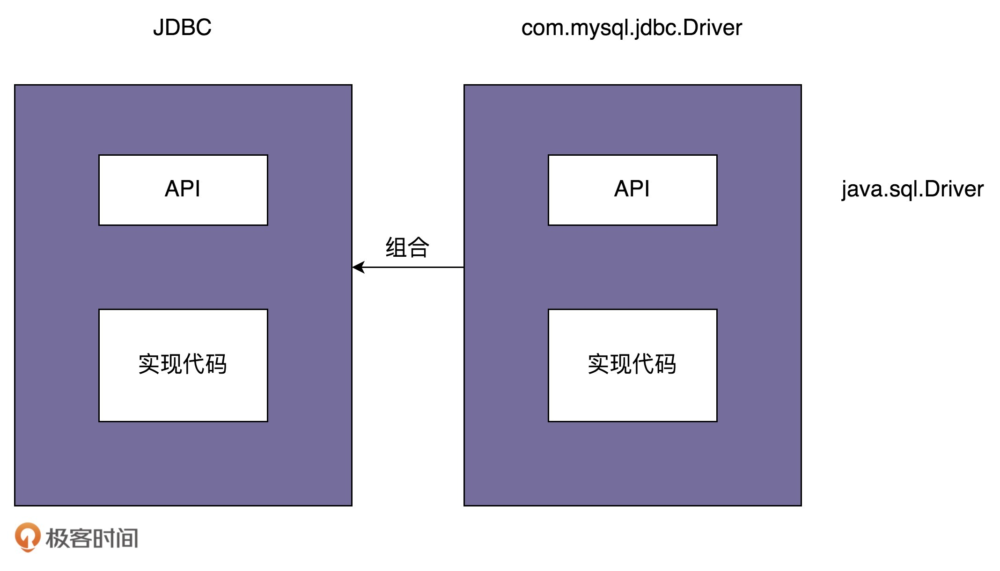

# 49 | 桥接模式：如何实现支持不同类型和渠道的消息推送系统？
上一节课我们学习了第一种结构型模式：代理模式。它在不改变原始类（或者叫被代理类）代码的情况下，通过引入代理类来给原始类附加功能。代理模式在平时的开发经常被用到，常用在业务系统中开发一些非功能性需求，比如：监控、统计、鉴权、限流、事务、幂等、日志。

今天，我们再学习另外一种结构型模式：桥接模式。桥接模式的代码实现非常简单，但是理解起来稍微有点难度，并且应用场景也比较局限，所以，相对于代理模式来说，桥接模式在实际的项目中并没有那么常用，你只需要简单了解，见到能认识就可以，并不是我们学习的重点。

话不多说，让我们正式开始今天的学习吧！

## 桥接模式的原理解析

**桥接模式**，也叫作 **桥梁模式**，英文是 **Bridge Design Pattern**。这个模式可以说是23种设计模式中最难理解的模式之一了。我查阅了比较多的书籍和资料之后发现，对于这个模式有两种不同的理解方式。

当然，这其中“最纯正”的理解方式，当属GoF的《设计模式》一书中对桥接模式的定义。毕竟，这23种经典的设计模式，最初就是由这本书总结出来的。在GoF的《设计模式》一书中，桥接模式是这么定义的：“Decouple an abstraction from its implementation so that the two can vary independently。”翻译成中文就是：“将抽象和实现解耦，让它们可以独立变化。”

关于桥接模式，很多书籍、资料中，还有另外一种理解方式：“一个类存在两个（或多个）独立变化的维度，我们通过组合的方式，让这两个（或多个）维度可以独立进行扩展。”通过组合关系来替代继承关系，避免继承层次的指数级爆炸。这种理解方式非常类似于，我们之前讲过的“组合优于继承”设计原则，所以，这里我就不多解释了。我们重点看下GoF的理解方式。

GoF给出的定义非常的简短，单凭这一句话，估计没几个人能看懂是什么意思。所以，我们通过JDBC驱动的例子来解释一下。JDBC驱动是桥接模式的经典应用。我们先来看一下，如何利用JDBC驱动来查询数据库。具体的代码如下所示：

```
Class.forName("com.mysql.jdbc.Driver");//加载及注册JDBC驱动程序
String url = "jdbc:mysql://localhost:3306/sample_db?user=root&password=your_password";
Connection con = DriverManager.getConnection(url);
Statement stmt = con.createStatement()；
String query = "select * from test";
ResultSet rs=stmt.executeQuery(query);
while(rs.next()) {
  rs.getString(1);
  rs.getInt(2);
}

```

如果我们想要把MySQL数据库换成Oracle数据库，只需要把第一行代码中的com.mysql.jdbc.Driver换成oracle.jdbc.driver.OracleDriver就可以了。当然，也有更灵活的实现方式，我们可以把需要加载的Driver类写到配置文件中，当程序启动的时候，自动从配置文件中加载，这样在切换数据库的时候，我们都不需要修改代码，只需要修改配置文件就可以了。

不管是改代码还是改配置，在项目中，从一个数据库切换到另一种数据库，都只需要改动很少的代码，或者完全不需要改动代码，那如此优雅的数据库切换是如何实现的呢？

源码之下无秘密。要弄清楚这个问题，我们先从com.mysql.jdbc.Driver这个类的代码看起。我摘抄了部分相关代码，放到了这里，你可以看一下。

```
package com.mysql.jdbc;
import java.sql.SQLException;

public class Driver extends NonRegisteringDriver implements java.sql.Driver {
	static {
		try {
			java.sql.DriverManager.registerDriver(new Driver());
		} catch (SQLException E) {
			throw new RuntimeException("Can't register driver!");
		}
	}

	/**
	 * Construct a new driver and register it with DriverManager
	 * @throws SQLException if a database error occurs.
	 */
	public Driver() throws SQLException {
		// Required for Class.forName().newInstance()
	}
}

```

结合com.mysql.jdbc.Driver的代码实现，我们可以发现，当执行Class.forName(“com.mysql.jdbc.Driver”)这条语句的时候，实际上是做了两件事情。第一件事情是要求JVM查找并加载指定的Driver类，第二件事情是执行该类的静态代码，也就是将MySQL Driver注册到DriverManager类中。

现在，我们再来看一下，DriverManager类是干什么用的。具体的代码如下所示。当我们把具体的Driver实现类（比如，com.mysql.jdbc.Driver）注册到DriverManager之后，后续所有对JDBC接口的调用，都会委派到对具体的Driver实现类来执行。而Driver实现类都实现了相同的接口（java.sql.Driver ），这也是可以灵活切换Driver的原因。

```
public class DriverManager {
  private final static CopyOnWriteArrayList<DriverInfo> registeredDrivers = new CopyOnWriteArrayList<DriverInfo>();

  //...
  static {
    loadInitialDrivers();
    println("JDBC DriverManager initialized");
  }
  //...

  public static synchronized void registerDriver(java.sql.Driver driver) throws SQLException {
    if (driver != null) {
      registeredDrivers.addIfAbsent(new DriverInfo(driver));
    } else {
      throw new NullPointerException();
    }
  }

  public static Connection getConnection(String url, String user, String password) throws SQLException {
    java.util.Properties info = new java.util.Properties();
    if (user != null) {
      info.put("user", user);
    }
    if (password != null) {
      info.put("password", password);
    }
    return (getConnection(url, info, Reflection.getCallerClass()));
  }
  //...
}

```

桥接模式的定义是“将抽象和实现解耦，让它们可以独立变化”。那弄懂定义中“抽象”和“实现”两个概念，就是理解桥接模式的关键。那在JDBC这个例子中，什么是“抽象”？什么是“实现”呢？

实际上，JDBC本身就相当于“抽象”。注意，这里所说的“抽象”，指的并非“抽象类”或“接口”，而是跟具体的数据库无关的、被抽象出来的一套“类库”。具体的Driver（比如，com.mysql.jdbc.Driver）就相当于“实现”。注意，这里所说的“实现”，也并非指“接口的实现类”，而是跟具体数据库相关的一套“类库”。JDBC和Driver独立开发，通过对象之间的组合关系，组装在一起。JDBC的所有逻辑操作，最终都委托给Driver来执行。

我画了一张图帮助你理解，你可以结合着我刚才的讲解一块看。



## 桥接模式的应用举例

在 [第16节](https://time.geekbang.org/column/article/176075) 中，我们讲过一个API接口监控告警的例子：根据不同的告警规则，触发不同类型的告警。告警支持多种通知渠道，包括：邮件、短信、微信、自动语音电话。通知的紧急程度有多种类型，包括：SEVERE（严重）、URGENCY（紧急）、NORMAL（普通）、TRIVIAL（无关紧要）。不同的紧急程度对应不同的通知渠道。比如，SERVE（严重）级别的消息会通过“自动语音电话”告知相关人员。

在当时的代码实现中，关于发送告警信息那部分代码，我们只给出了粗略的设计，现在我们来一块实现一下。我们先来看最简单、最直接的一种实现方式。代码如下所示：

```
public enum NotificationEmergencyLevel {
  SEVERE, URGENCY, NORMAL, TRIVIAL
}

public class Notification {
  private List<String> emailAddresses;
  private List<String> telephones;
  private List<String> wechatIds;

  public Notification() {}

  public void setEmailAddress(List<String> emailAddress) {
    this.emailAddresses = emailAddress;
  }

  public void setTelephones(List<String> telephones) {
    this.telephones = telephones;
  }

  public void setWechatIds(List<String> wechatIds) {
    this.wechatIds = wechatIds;
  }

  public void notify(NotificationEmergencyLevel level, String message) {
    if (level.equals(NotificationEmergencyLevel.SEVERE)) {
      //...自动语音电话
    } else if (level.equals(NotificationEmergencyLevel.URGENCY)) {
      //...发微信
    } else if (level.equals(NotificationEmergencyLevel.NORMAL)) {
      //...发邮件
    } else if (level.equals(NotificationEmergencyLevel.TRIVIAL)) {
      //...发邮件
    }
  }
}

//在API监控告警的例子中，我们如下方式来使用Notification类：
public class ErrorAlertHandler extends AlertHandler {
  public ErrorAlertHandler(AlertRule rule, Notification notification){
    super(rule, notification);
  }

  @Override
  public void check(ApiStatInfo apiStatInfo) {
    if (apiStatInfo.getErrorCount() > rule.getMatchedRule(apiStatInfo.getApi()).getMaxErrorCount()) {
      notification.notify(NotificationEmergencyLevel.SEVERE, "...");
    }
  }
}

```

Notification类的代码实现有一个最明显的问题，那就是有很多if-else分支逻辑。实际上，如果每个分支中的代码都不复杂，后期也没有无限膨胀的可能（增加更多if-else分支判断），那这样的设计问题并不大，没必要非得一定要摒弃if-else分支逻辑。

不过，Notification的代码显然不符合这个条件。因为每个if-else分支中的代码逻辑都比较复杂，发送通知的所有逻辑都扎堆在Notification类中。我们知道，类的代码越多，就越难读懂，越难修改，维护的成本也就越高。很多设计模式都是试图将庞大的类拆分成更细小的类，然后再通过某种更合理的结构组装在一起。

针对Notification的代码，我们将不同渠道的发送逻辑剥离出来，形成独立的消息发送类（MsgSender相关类）。其中，Notification类相当于抽象，MsgSender类相当于实现，两者可以独立开发，通过组合关系（也就是桥梁）任意组合在一起。所谓任意组合的意思就是，不同紧急程度的消息和发送渠道之间的对应关系，不是在代码中固定写死的，我们可以动态地去指定（比如，通过读取配置来获取对应关系）。

按照这个设计思路，我们对代码进行重构。重构之后的代码如下所示：

```
public interface MsgSender {
  void send(String message);
}

public class TelephoneMsgSender implements MsgSender {
  private List<String> telephones;

  public TelephoneMsgSender(List<String> telephones) {
    this.telephones = telephones;
  }

  @Override
  public void send(String message) {
    //...
  }

}

public class EmailMsgSender implements MsgSender {
  // 与TelephoneMsgSender代码结构类似，所以省略...
}

public class WechatMsgSender implements MsgSender {
  // 与TelephoneMsgSender代码结构类似，所以省略...
}

public abstract class Notification {
  protected MsgSender msgSender;

  public Notification(MsgSender msgSender) {
    this.msgSender = msgSender;
  }

  public abstract void notify(String message);
}

public class SevereNotification extends Notification {
  public SevereNotification(MsgSender msgSender) {
    super(msgSender);
  }

  @Override
  public void notify(String message) {
    msgSender.send(message);
  }
}

public class UrgencyNotification extends Notification {
  // 与SevereNotification代码结构类似，所以省略...
}
public class NormalNotification extends Notification {
  // 与SevereNotification代码结构类似，所以省略...
}
public class TrivialNotification extends Notification {
  // 与SevereNotification代码结构类似，所以省略...
}

```

## 重点回顾

好了，今天的内容到此就讲完了。我们一块来总结回顾一下，你需要重点掌握的内容。

总体上来讲，桥接模式的原理比较难理解，但代码实现相对简单。

对于这个模式有两种不同的理解方式。在GoF的《设计模式》一书中，桥接模式被定义为：“将抽象和实现解耦，让它们可以独立变化。”在其他资料和书籍中，还有另外一种更加简单的理解方式：“一个类存在两个（或多个）独立变化的维度，我们通过组合的方式，让这两个（或多个）维度可以独立进行扩展。”

对于第一种GoF的理解方式，弄懂定义中“抽象”和“实现”两个概念，是理解它的关键。定义中的“抽象”，指的并非“抽象类”或“接口”，而是被抽象出来的一套“类库”，它只包含骨架代码，真正的业务逻辑需要委派给定义中的“实现”来完成。而定义中的“实现”，也并非“接口的实现类”，而是一套独立的“类库”。“抽象”和“实现”独立开发，通过对象之间的组合关系，组装在一起。

对于第二种理解方式，它非常类似我们之前讲过的“组合优于继承”设计原则，通过组合关系来替代继承关系，避免继承层次的指数级爆炸。

## 课堂讨论

在桥接模式的第二种理解方式的第一段代码实现中，Notification类中的三个成员变量通过set方法来设置，但是这样的代码实现存在一个明显的问题，那就是emailAddresses、telephones、wechatIds中的数据有可能在Notification类外部被修改，那如何重构代码才能避免这种情况的发生呢？

```
public class Notification {
  private List<String> emailAddresses;
  private List<String> telephones;
  private List<String> wechatIds;

  public Notification() {}

  public void setEmailAddress(List<String> emailAddress) {
    this.emailAddresses = emailAddress;
  }

  public void setTelephones(List<String> telephones) {
    this.telephones = telephones;
  }

  public void setWechatIds(List<String> wechatIds) {
    this.wechatIds = wechatIds;
  }
  //...
}

```

欢迎留言和我分享你的思考和疑惑。如果有收获，也欢迎你把这篇文章分享给你的朋友。