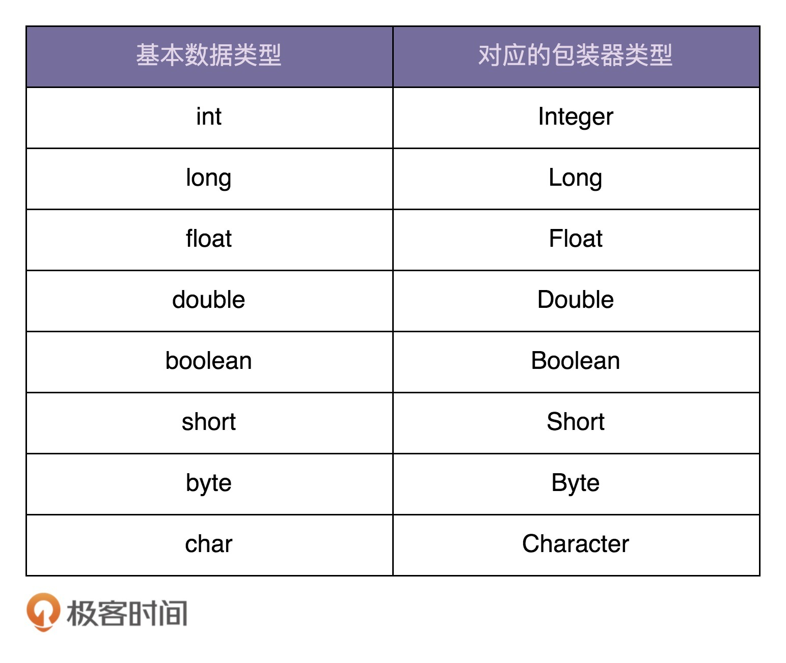
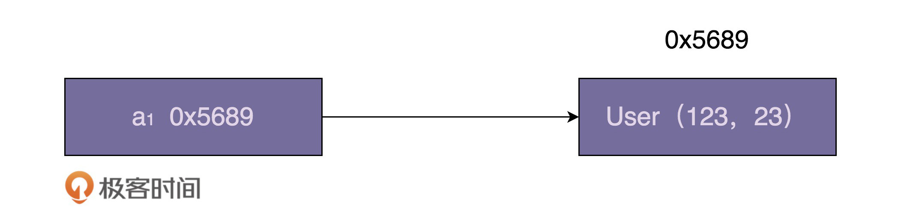
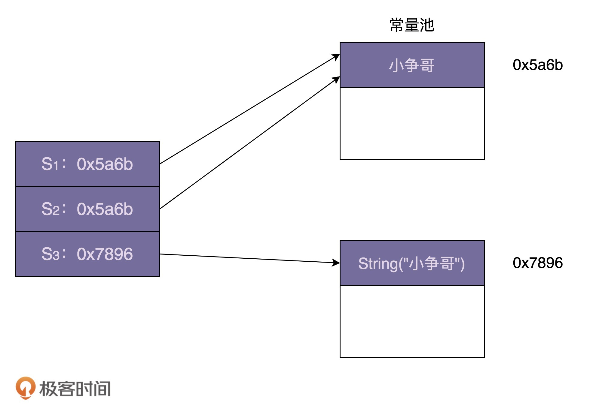

# 55 | 享元模式（下）：剖析享元模式在Java Integer、String中的应用
上一节课，我们通过棋牌游戏和文本编辑器这样两个实际的例子，学习了享元模式的原理、实现以及应用场景。用一句话总结一下，享元模式中的“享元”指被共享的单元。享元模式通过复用对象，以达到节省内存的目的。

今天，我再用一节课的时间带你剖析一下，享元模式在Java Integer、String中的应用。如果你不熟悉Java编程语言，那也不用担心看不懂，因为今天的内容主要还是介绍设计思路，跟语言本身关系不大。

话不多说，让我们正式开始今天的学习吧！

## 享元模式在Java Integer中的应用

我们先来看下面这样一段代码。你可以先思考下，这段代码会输出什么样的结果。

```
Integer i1 = 56;
Integer i2 = 56;
Integer i3 = 129;
Integer i4 = 129;
System.out.println(i1 == i2);
System.out.println(i3 == i4);

```

如果不熟悉Java语言，你可能会觉得，i1和i2值都是56，i3和i4值都是129，i1跟i2值相等，i3跟i4值相等，所以输出结果应该是两个true。这样的分析是不对的，主要还是因为你对Java语法不熟悉。要正确地分析上面的代码，我们需要弄清楚下面两个问题：

- 如何判定两个Java对象是否相等（也就代码中的“==”操作符的含义）？
- 什么是自动装箱（Autoboxing）和自动拆箱（Unboxing）？

在 [加餐一](https://time.geekbang.org/column/article/166698) 中，我们讲到，Java为基本数据类型提供了对应的包装器类型。具体如下所示：



所谓的自动装箱，就是自动将基本数据类型转换为包装器类型。所谓的自动拆箱，也就是自动将包装器类型转化为基本数据类型。具体的代码示例如下所示：

```
Integer i = 56; //自动装箱
int j = i; //自动拆箱

```

数值56是基本数据类型int，当赋值给包装器类型（Integer）变量的时候，触发自动装箱操作，创建一个Integer类型的对象，并且赋值给变量i。其底层相当于执行了下面这条语句：

```
Integer i = 59；底层执行了：Integer i = Integer.valueOf(59);

```

反过来，当把包装器类型的变量i，赋值给基本数据类型变量j的时候，触发自动拆箱操作，将i中的数据取出，赋值给j。其底层相当于执行了下面这条语句：

```
int j = i; 底层执行了：int j = i.intValue();

```

弄清楚了自动装箱和自动拆箱，我们再来看，如何判定两个对象是否相等？不过，在此之前，我们先要搞清楚，Java对象在内存中是如何存储的。我们通过下面这个例子来说明一下。

```
User a = new User(123, 23); // id=123, age=23

```

针对这条语句，我画了一张内存存储结构图，如下所示。a存储的值是User对象的内存地址，在图中就表现为a指向User对象。



当我们通过“==”来判定两个对象是否相等的时候，实际上是在判断两个局部变量存储的地址是否相同，换句话说，是在判断两个局部变量是否指向相同的对象。

了解了Java的这几个语法之后，我们重新看一下开头的那段代码。

```
Integer i1 = 56;
Integer i2 = 56;
Integer i3 = 129;
Integer i4 = 129;
System.out.println(i1 == i2);
System.out.println(i3 == i4);

```

前4行赋值语句都会触发自动装箱操作，也就是会创建Integer对象并且赋值给i1、i2、i3、i4这四个变量。根据刚刚的讲解，i1、i2尽管存储的数值相同，都是56，但是指向不同的Integer对象，所以通过“==”来判定是否相同的时候，会返回false。同理，i3==i4判定语句也会返回false。

不过，上面的分析还是不对，答案并非是两个false，而是一个true，一个false。看到这里，你可能会比较纳闷了。实际上，这正是因为Integer用到了享元模式来复用对象，才导致了这样的运行结果。当我们通过自动装箱，也就是调用valueOf()来创建Integer对象的时候，如果要创建的Integer对象的值在-128到127之间，会从IntegerCache类中直接返回，否则才调用new方法创建。看代码更加清晰一些，Integer类的valueOf()函数的具体代码如下所示：

```
public static Integer valueOf(int i) {
    if (i >= IntegerCache.low && i <= IntegerCache.high)
        return IntegerCache.cache[i + (-IntegerCache.low)];
    return new Integer(i);
}

```

实际上，这里的IntegerCache相当于，我们上一节课中讲的生成享元对象的工厂类，只不过名字不叫xxxFactory而已。我们来看它的具体代码实现。这个类是Integer的内部类，你也可以自行查看JDK源码。

```
/**
 * Cache to support the object identity semantics of autoboxing for values between
 * -128 and 127 (inclusive) as required by JLS.
 *
 * The cache is initialized on first usage.  The size of the cache
 * may be controlled by the {@code -XX:AutoBoxCacheMax=<size>} option.
 * During VM initialization, java.lang.Integer.IntegerCache.high property
 * may be set and saved in the private system properties in the
 * sun.misc.VM class.
 */
private static class IntegerCache {
    static final int low = -128;
    static final int high;
    static final Integer cache[];

    static {
        // high value may be configured by property
        int h = 127;
        String integerCacheHighPropValue =
            sun.misc.VM.getSavedProperty("java.lang.Integer.IntegerCache.high");
        if (integerCacheHighPropValue != null) {
            try {
                int i = parseInt(integerCacheHighPropValue);
                i = Math.max(i, 127);
                // Maximum array size is Integer.MAX_VALUE
                h = Math.min(i, Integer.MAX_VALUE - (-low) -1);
            } catch( NumberFormatException nfe) {
                // If the property cannot be parsed into an int, ignore it.
            }
        }
        high = h;

        cache = new Integer[(high - low) + 1];
        int j = low;
        for(int k = 0; k < cache.length; k++)
            cache[k] = new Integer(j++);

        // range [-128, 127] must be interned (JLS7 5.1.7)
        assert IntegerCache.high >= 127;
    }

    private IntegerCache() {}
}

```

为什么IntegerCache只缓存-128到127之间的整型值呢？

在IntegerCache的代码实现中，当这个类被加载的时候，缓存的享元对象会被集中一次性创建好。毕竟整型值太多了，我们不可能在IntegerCache类中预先创建好所有的整型值，这样既占用太多内存，也使得加载IntegerCache类的时间过长。所以，我们只能选择缓存对于大部分应用来说最常用的整型值，也就是一个字节的大小（-128到127之间的数据）。

实际上，JDK也提供了方法来让我们可以自定义缓存的最大值，有下面两种方式。如果你通过分析应用的JVM内存占用情况，发现-128到255之间的数据占用的内存比较多，你就可以用如下方式，将缓存的最大值从127调整到255。不过，这里注意一下，JDK并没有提供设置最小值的方法。

```
//方法一：
-Djava.lang.Integer.IntegerCache.high=255
//方法二：
-XX:AutoBoxCacheMax=255

```

现在，让我们再回到最开始的问题，因为56处于-128和127之间，i1和i2会指向相同的享元对象，所以i1==i2返回true。而129大于127，并不会被缓存，每次都会创建一个全新的对象，也就是说，i3和i4指向不同的Integer对象，所以i3==i4返回false。

实际上，除了Integer类型之外，其他包装器类型，比如Long、Short、Byte等，也都利用了享元模式来缓存-128到127之间的数据。比如，Long类型对应的LongCache享元工厂类及valueOf()函数代码如下所示：

```
private static class LongCache {
    private LongCache(){}

    static final Long cache[] = new Long[-(-128) + 127 + 1];

    static {
        for(int i = 0; i < cache.length; i++)
            cache[i] = new Long(i - 128);
    }
}

public static Long valueOf(long l) {
    final int offset = 128;
    if (l >= -128 && l <= 127) { // will cache
        return LongCache.cache[(int)l + offset];
    }
    return new Long(l);
}

```

在我们平时的开发中，对于下面这样三种创建整型对象的方式，我们优先使用后两种。

```
Integer a = new Integer(123);
Integer a = 123;
Integer a = Integer.valueOf(123);

```

第一种创建方式并不会使用到IntegerCache，而后面两种创建方法可以利用IntegerCache缓存，返回共享的对象，以达到节省内存的目的。举一个极端一点的例子，假设程序需要创建1万个-128到127之间的Integer对象。使用第一种创建方式，我们需要分配1万个Integer对象的内存空间；使用后两种创建方式，我们最多只需要分配256个Integer对象的内存空间。

## 享元模式在Java String中的应用

刚刚我们讲了享元模式在Java Integer类中的应用，现在，我们再来看下，享元模式在Java String类中的应用。同样，我们还是先来看一段代码，你觉得这段代码输出的结果是什么呢？

```
String s1 = "小争哥";
String s2 = "小争哥";
String s3 = new String("小争哥");

System.out.println(s1 == s2);
System.out.println(s1 == s3);

```

上面代码的运行结果是：一个true，一个false。跟Integer类的设计思路相似，String类利用享元模式来复用相同的字符串常量（也就是代码中的“小争哥”）。JVM会专门开辟一块存储区来存储字符串常量，这块存储区叫作“字符串常量池”。上面代码对应的内存存储结构如下所示：



不过，String类的享元模式的设计，跟Integer类稍微有些不同。Integer类中要共享的对象，是在类加载的时候，就集中一次性创建好的。但是，对于字符串来说，我们没法事先知道要共享哪些字符串常量，所以没办法事先创建好，只能在某个字符串常量第一次被用到的时候，存储到常量池中，当之后再用到的时候，直接引用常量池中已经存在的即可，就不需要再重新创建了。

## 重点回顾

好了，今天的内容到此就讲完了。我们一块来总结回顾一下，你需要重点掌握的内容。

在Java Integer的实现中，-128到127之间的整型对象会被事先创建好，缓存在IntegerCache类中。当我们使用自动装箱或者valueOf()来创建这个数值区间的整型对象时，会复用IntegerCache类事先创建好的对象。这里的IntegerCache类就是享元工厂类，事先创建好的整型对象就是享元对象。

在Java String类的实现中，JVM开辟一块存储区专门存储字符串常量，这块存储区叫作字符串常量池，类似于Integer中的IntegerCache。不过，跟IntegerCache不同的是，它并非事先创建好需要共享的对象，而是在程序的运行期间，根据需要来创建和缓存字符串常量。

除此之外，这里我再补充强调一下。

实际上，享元模式对JVM的垃圾回收并不友好。因为享元工厂类一直保存了对享元对象的引用，这就导致享元对象在没有任何代码使用的情况下，也并不会被JVM垃圾回收机制自动回收掉。因此，在某些情况下，如果对象的生命周期很短，也不会被密集使用，利用享元模式反倒可能会浪费更多的内存。所以，除非经过线上验证，利用享元模式真的可以大大节省内存，否则，就不要过度使用这个模式，为了一点点内存的节省而引入一个复杂的设计模式，得不偿失啊。

## 课堂讨论

IntegerCache只能缓存事先指定好的整型对象，那我们是否可以借鉴String的设计思路，不事先指定需要缓存哪些整型对象，而是在程序的运行过程中，当用到某个整型对象的时候，创建好放置到IntegerCache，下次再被用到的时候，直接从IntegerCache中返回呢？

如果可以这么做，请你按照这个思路重新实现一下IntegerCache类，并且能够做到在某个对象没有任何代码使用的时候，能被JVM垃圾回收机制回收掉。

欢迎留言和我分享你的想法，如果有收获，欢迎你把这篇文章分享给你的朋友。