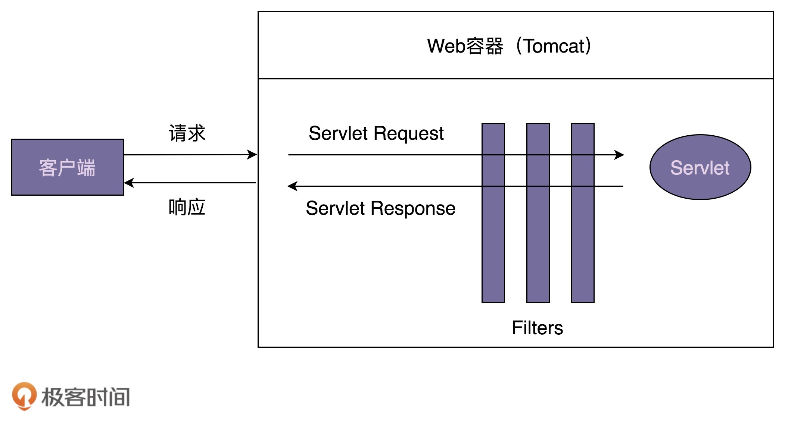
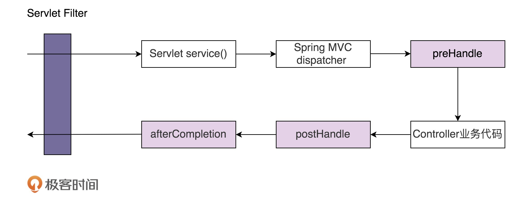

# 63 | 职责链模式（下）：框架中常用的过滤器、拦截器是如何实现的？
上一节课，我们学习职责链模式的原理与实现，并且通过一个敏感词过滤框架的例子，展示了职责链模式的设计意图。本质上来说，它跟大部分设计模式一样，都是为了解耦代码，应对代码的复杂性，让代码满足开闭原则，提高代码的可扩展性。

除此之外，我们还提到，职责链模式常用在框架的开发中，为框架提供扩展点，让框架的使用者在不修改框架源码的情况下，基于扩展点添加新的功能。实际上，更具体点来说，职责链模式最常用来开发框架的过滤器和拦截器。今天，我们就通过Servlet Filter、Spring Interceptor这两个Java开发中常用的组件，来具体讲讲它在框架开发中的应用。

话不多说，让我们正式开始今天的学习吧！

## Servlet Filter

Servlet Filter是Java Servlet规范中定义的组件，翻译成中文就是过滤器，它可以实现对HTTP请求的过滤功能，比如鉴权、限流、记录日志、验证参数等等。因为它是Servlet规范的一部分，所以，只要是支持Servlet的Web容器（比如，Tomcat、Jetty等），都支持过滤器功能。为了帮助你理解，我画了一张示意图阐述它的工作原理，如下所示。



在实际项目中，我们该如何使用Servlet Filter呢？我写了一个简单的示例代码，如下所示。添加一个过滤器，我们只需要定义一个实现javax.servlet.Filter接口的过滤器类，并且将它配置在web.xml配置文件中。Web容器启动的时候，会读取web.xml中的配置，创建过滤器对象。当有请求到来的时候，会先经过过滤器，然后才由Servlet来处理。

```
public class LogFilter implements Filter {
  @Override
  public void init(FilterConfig filterConfig) throws ServletException {
    // 在创建Filter时自动调用，
    // 其中filterConfig包含这个Filter的配置参数，比如name之类的（从配置文件中读取的）
  }

  @Override
  public void doFilter(ServletRequest request, ServletResponse response, FilterChain chain) throws IOException, ServletException {
    System.out.println("拦截客户端发送来的请求.");
    chain.doFilter(request, response);
    System.out.println("拦截发送给客户端的响应.");
  }

  @Override
  public void destroy() {
    // 在销毁Filter时自动调用
  }
}

// 在web.xml配置文件中如下配置：
<filter>
  <filter-name>logFilter</filter-name>
  <filter-class>com.xzg.cd.LogFilter</filter-class>
</filter>
<filter-mapping>
    <filter-name>logFilter</filter-name>
    <url-pattern>/*</url-pattern>
</filter-mapping>

```

从刚刚的示例代码中，我们发现，添加过滤器非常方便，不需要修改任何代码，定义一个实现javax.servlet.Filter的类，再改改配置就搞定了，完全符合开闭原则。那Servlet Filter是如何做到如此好的扩展性的呢？我想你应该已经猜到了，它利用的就是职责链模式。现在，我们通过剖析它的源码，详细地看看它底层是如何实现的。

在上一节课中，我们讲到，职责链模式的实现包含处理器接口（IHandler）或抽象类（Handler），以及处理器链（HandlerChain）。对应到Servlet Filter，javax.servlet.Filter就是处理器接口，FilterChain就是处理器链。接下来，我们重点来看FilterChain是如何实现的。

不过，我们前面也讲过，Servlet只是一个规范，并不包含具体的实现，所以，Servlet中的FilterChain只是一个接口定义。具体的实现类由遵从Servlet规范的Web容器来提供，比如，ApplicationFilterChain类就是Tomcat提供的FilterChain的实现类，源码如下所示。

为了让代码更易读懂，我对代码进行了简化，只保留了跟设计思路相关的代码片段。完整的代码你可以自行去Tomcat中查看。

```
public final class ApplicationFilterChain implements FilterChain {
  private int pos = 0; //当前执行到了哪个filter
  private int n; //filter的个数
  private ApplicationFilterConfig[] filters;
  private Servlet servlet;

  @Override
  public void doFilter(ServletRequest request, ServletResponse response) {
    if (pos < n) {
      ApplicationFilterConfig filterConfig = filters[pos++];
      Filter filter = filterConfig.getFilter();
      filter.doFilter(request, response, this);
    } else {
      // filter都处理完毕后，执行servlet
      servlet.service(request, response);
    }
  }

  public void addFilter(ApplicationFilterConfig filterConfig) {
    for (ApplicationFilterConfig filter:filters)
      if (filter==filterConfig)
         return;

    if (n == filters.length) {//扩容
      ApplicationFilterConfig[] newFilters = new ApplicationFilterConfig[n + INCREMENT];
      System.arraycopy(filters, 0, newFilters, 0, n);
      filters = newFilters;
    }
    filters[n++] = filterConfig;
  }
}

```

ApplicationFilterChain中的doFilter()函数的代码实现比较有技巧，实际上是一个递归调用。你可以用每个Filter（比如LogFilter）的doFilter()的代码实现，直接替换ApplicationFilterChain的第12行代码，一眼就能看出是递归调用了。我替换了一下，如下所示。

```
  @Override
  public void doFilter(ServletRequest request, ServletResponse response) {
    if (pos < n) {
      ApplicationFilterConfig filterConfig = filters[pos++];
      Filter filter = filterConfig.getFilter();
      //filter.doFilter(request, response, this);
      //把filter.doFilter的代码实现展开替换到这里
      System.out.println("拦截客户端发送来的请求.");
      chain.doFilter(request, response); // chain就是this
      System.out.println("拦截发送给客户端的响应.")
    } else {
      // filter都处理完毕后，执行servlet
      servlet.service(request, response);
    }
  }

```

这样实现主要是为了在一个doFilter()方法中，支持双向拦截，既能拦截客户端发送来的请求，也能拦截发送给客户端的响应，你可以结合着LogFilter那个例子，以及对比待会要讲到的Spring Interceptor，来自己理解一下。而我们上一节课给出的两种实现方式，都没法做到在业务逻辑执行的前后，同时添加处理代码。

## Spring Interceptor

刚刚讲了Servlet Filter，现在我们来讲一个功能上跟它非常类似的东西，Spring Interceptor，翻译成中文就是拦截器。尽管英文单词和中文翻译都不同，但这两者基本上可以看作一个概念，都用来实现对HTTP请求进行拦截处理。

它们不同之处在于，Servlet Filter是Servlet规范的一部分，实现依赖于Web容器。Spring Interceptor是Spring MVC框架的一部分，由Spring MVC框架来提供实现。客户端发送的请求，会先经过Servlet Filter，然后再经过Spring Interceptor，最后到达具体的业务代码中。我画了一张图来阐述一个请求的处理流程，具体如下所示。



在项目中，我们该如何使用Spring Interceptor呢？我写了一个简单的示例代码，如下所示。LogInterceptor实现的功能跟刚才的LogFilter完全相同，只是实现方式上稍有区别。LogFilter对请求和响应的拦截是在doFilter()一个函数中实现的，而LogInterceptor对请求的拦截在preHandle()中实现，对响应的拦截在postHandle()中实现。

```
public class LogInterceptor implements HandlerInterceptor {

  @Override
  public boolean preHandle(HttpServletRequest request, HttpServletResponse response, Object handler) throws Exception {
    System.out.println("拦截客户端发送来的请求.");
    return true; // 继续后续的处理
  }

  @Override
  public void postHandle(HttpServletRequest request, HttpServletResponse response, Object handler, ModelAndView modelAndView) throws Exception {
    System.out.println("拦截发送给客户端的响应.");
  }

  @Override
  public void afterCompletion(HttpServletRequest request, HttpServletResponse response, Object handler, Exception ex) throws Exception {
    System.out.println("这里总是被执行.");
  }
}

//在Spring MVC配置文件中配置interceptors
<mvc:interceptors>
   <mvc:interceptor>
       <mvc:mapping path="/*"/>
       <bean class="com.xzg.cd.LogInterceptor" />
   </mvc:interceptor>
</mvc:interceptors>

```

同样，我们还是来剖析一下，Spring Interceptor底层是如何实现的。

当然，它也是基于职责链模式实现的。其中，HandlerExecutionChain类是职责链模式中的处理器链。它的实现相较于Tomcat中的ApplicationFilterChain来说，逻辑更加清晰，不需要使用递归来实现，主要是因为它将请求和响应的拦截工作，拆分到了两个函数中实现。HandlerExecutionChain的源码如下所示，同样，我对代码也进行了一些简化，只保留了关键代码。

```
public class HandlerExecutionChain {
 private final Object handler;
 private HandlerInterceptor[] interceptors;

 public void addInterceptor(HandlerInterceptor interceptor) {
  initInterceptorList().add(interceptor);
 }

 boolean applyPreHandle(HttpServletRequest request, HttpServletResponse response) throws Exception {
  HandlerInterceptor[] interceptors = getInterceptors();
  if (!ObjectUtils.isEmpty(interceptors)) {
   for (int i = 0; i < interceptors.length; i++) {
    HandlerInterceptor interceptor = interceptors[i];
    if (!interceptor.preHandle(request, response, this.handler)) {
     triggerAfterCompletion(request, response, null);
     return false;
    }
   }
  }
  return true;
 }

 void applyPostHandle(HttpServletRequest request, HttpServletResponse response, ModelAndView mv) throws Exception {
  HandlerInterceptor[] interceptors = getInterceptors();
  if (!ObjectUtils.isEmpty(interceptors)) {
   for (int i = interceptors.length - 1; i >= 0; i--) {
    HandlerInterceptor interceptor = interceptors[i];
    interceptor.postHandle(request, response, this.handler, mv);
   }
  }
 }

 void triggerAfterCompletion(HttpServletRequest request, HttpServletResponse response, Exception ex)
   throws Exception {
  HandlerInterceptor[] interceptors = getInterceptors();
  if (!ObjectUtils.isEmpty(interceptors)) {
   for (int i = this.interceptorIndex; i >= 0; i--) {
    HandlerInterceptor interceptor = interceptors[i];
    try {
     interceptor.afterCompletion(request, response, this.handler, ex);
    } catch (Throwable ex2) {
     logger.error("HandlerInterceptor.afterCompletion threw exception", ex2);
    }
   }
  }
 }
}

```

在Spring框架中，DispatcherServlet的doDispatch()方法来分发请求，它在真正的业务逻辑执行前后，执行HandlerExecutionChain中的applyPreHandle()和applyPostHandle()函数，用来实现拦截的功能。具体的代码实现很简单，你自己应该能脑补出来，这里就不罗列了。感兴趣的话，你可以自行去查看。

## 重点回顾

好了，今天的内容到此就讲完了。我们一块来总结回顾一下，你需要重点掌握的内容。

职责链模式常用在框架开发中，用来实现框架的过滤器、拦截器功能，让框架的使用者在不需要修改框架源码的情况下，添加新的过滤拦截功能。这也体现了之前讲到的对扩展开放、对修改关闭的设计原则。

今天，我们通过Servlet Filter、Spring Interceptor两个实际的例子，给你展示了在框架开发中职责链模式具体是怎么应用的。从源码中，我们还可以发现，尽管上一节课中我们有给出职责链模式的经典代码实现，但在实际的开发中，我们还是要具体问题具体对待，代码实现会根据不同的需求有所变化。实际上，这一点对于所有的设计模式都适用。

## 课堂讨论

1. 前面在讲代理模式的时候，我们提到，Spring AOP是基于代理模式来实现的。在实际的项目开发中，我们可以利用AOP来实现访问控制功能，比如鉴权、限流、日志等。今天我们又讲到，Servlet Filter、Spring Interceptor也可以用来实现访问控制。那在项目开发中，类似权限这样的访问控制功能，我们该选择三者（AOP、Servlet Filter、Spring Interceptor）中的哪个来实现呢？有什么参考标准吗？
2. 除了我们讲到的Servlet Filter、Spring Interceptor之外，Dubbo Filter、Netty ChannelPipeline也是职责链模式的实际应用案例，你能否找一个你熟悉的并且用到职责链模式的框架，像我一样分析一下它的底层实现呢？

欢迎留言和我分享你的想法。如果有收获，欢迎你把这篇文章分享给你的朋友。