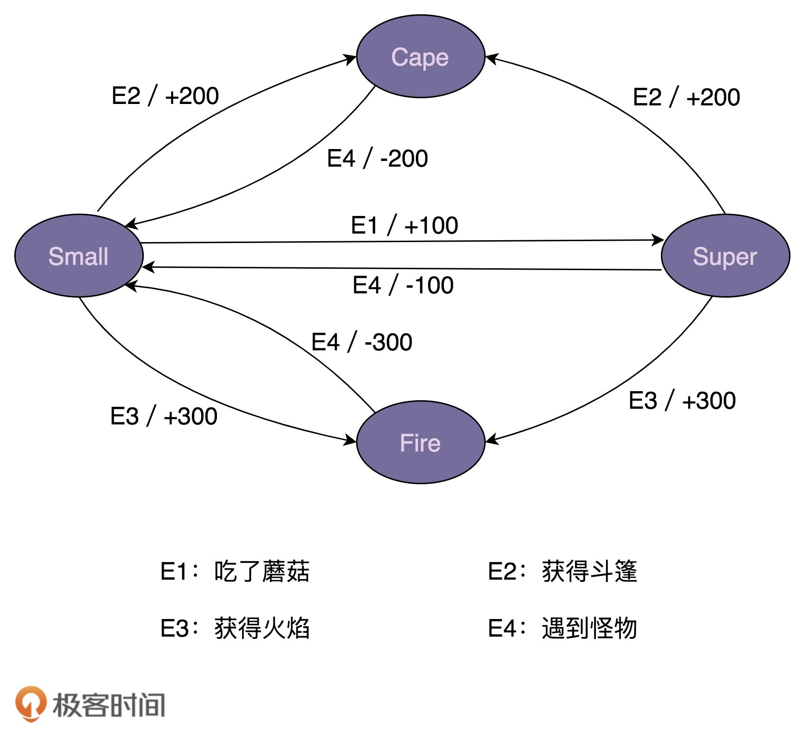
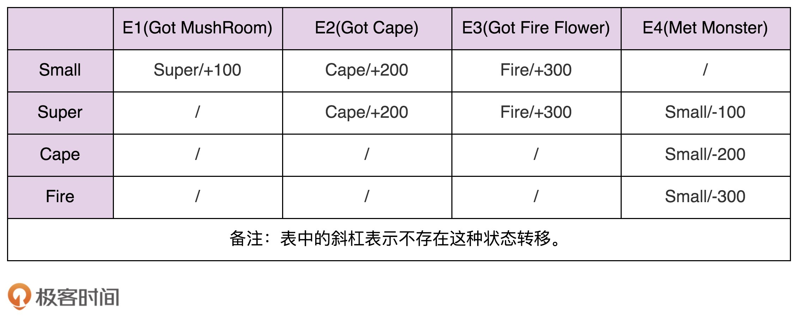

# 64 | 状态模式：游戏、工作流引擎中常用的状态机是如何实现的？
从今天起，我们开始学习状态模式。在实际的软件开发中，状态模式并不是很常用，但是在能够用到的场景里，它可以发挥很大的作用。从这一点上来看，它有点像我们之前讲到的组合模式。

状态模式一般用来实现状态机，而状态机常用在游戏、工作流引擎等系统开发中。不过，状态机的实现方式有多种，除了状态模式，比较常用的还有分支逻辑法和查表法。今天，我们就详细讲讲这几种实现方式，并且对比一下它们的优劣和应用场景。

话不多说，让我们正式开始今天的学习吧！

## 什么是有限状态机？

有限状态机，英文翻译是Finite State Machine，缩写为FSM，简称为状态机。状态机有3个组成部分：状态（State）、事件（Event）、动作（Action）。其中，事件也称为转移条件（Transition Condition）。事件触发状态的转移及动作的执行。不过，动作不是必须的，也可能只转移状态，不执行任何动作。

对于刚刚给出的状态机的定义，我结合一个具体的例子，来进一步解释一下。

“超级马里奥”游戏不知道你玩过没有？在游戏中，马里奥可以变身为多种形态，比如小马里奥（Small Mario）、超级马里奥（Super Mario）、火焰马里奥（Fire Mario）、斗篷马里奥（Cape Mario）等等。在不同的游戏情节下，各个形态会互相转化，并相应的增减积分。比如，初始形态是小马里奥，吃了蘑菇之后就会变成超级马里奥，并且增加100积分。

实际上，马里奥形态的转变就是一个状态机。其中，马里奥的不同形态就是状态机中的“状态”，游戏情节（比如吃了蘑菇）就是状态机中的“事件”，加减积分就是状态机中的“动作”。比如，吃蘑菇这个事件，会触发状态的转移：从小马里奥转移到超级马里奥，以及触发动作的执行（增加100积分）。

为了方便接下来的讲解，我对游戏背景做了简化，只保留了部分状态和事件。简化之后的状态转移如下图所示：



我们如何编程来实现上面的状态机呢？换句话说，如何将上面的状态转移图翻译成代码呢？

我写了一个骨架代码，如下所示。其中，obtainMushRoom()、obtainCape()、obtainFireFlower()、meetMonster()这几个函数，能够根据当前的状态和事件，更新状态和增减积分。不过，具体的代码实现我暂时并没有给出。你可以把它当做面试题，试着补全一下，然后再来看我下面的讲解，这样你的收获会更大。

```
public enum State {
  SMALL(0),
  SUPER(1),
  FIRE(2),
  CAPE(3);

  private int value;

  private State(int value) {
    this.value = value;
  }

  public int getValue() {
    return this.value;
  }
}

public class MarioStateMachine {
  private int score;
  private State currentState;

  public MarioStateMachine() {
    this.score = 0;
    this.currentState = State.SMALL;
  }

  public void obtainMushRoom() {
    //TODO
  }

  public void obtainCape() {
    //TODO
  }

  public void obtainFireFlower() {
    //TODO
  }

  public void meetMonster() {
    //TODO
  }

  public int getScore() {
    return this.score;
  }

  public State getCurrentState() {
    return this.currentState;
  }
}

public class ApplicationDemo {
  public static void main(String[] args) {
    MarioStateMachine mario = new MarioStateMachine();
    mario.obtainMushRoom();
    int score = mario.getScore();
    State state = mario.getCurrentState();
    System.out.println("mario score: " + score + "; state: " + state);
  }
}

```

## 状态机实现方式一：分支逻辑法

对于如何实现状态机，我总结了三种方式。其中，最简单直接的实现方式是，参照状态转移图，将每一个状态转移，原模原样地直译成代码。这样编写的代码会包含大量的if-else或switch-case分支判断逻辑，甚至是嵌套的分支判断逻辑，所以，我把这种方法暂且命名为分支逻辑法。

按照这个实现思路，我将上面的骨架代码补全一下。补全之后的代码如下所示：

```
public class MarioStateMachine {
  private int score;
  private State currentState;

  public MarioStateMachine() {
    this.score = 0;
    this.currentState = State.SMALL;
  }

  public void obtainMushRoom() {
    if (currentState.equals(State.SMALL)) {
      this.currentState = State.SUPER;
      this.score += 100;
    }
  }

  public void obtainCape() {
    if (currentState.equals(State.SMALL) || currentState.equals(State.SUPER) ) {
      this.currentState = State.CAPE;
      this.score += 200;
    }
  }

  public void obtainFireFlower() {
    if (currentState.equals(State.SMALL) || currentState.equals(State.SUPER) ) {
      this.currentState = State.FIRE;
      this.score += 300;
    }
  }

  public void meetMonster() {
    if (currentState.equals(State.SUPER)) {
      this.currentState = State.SMALL;
      this.score -= 100;
      return;
    }

    if (currentState.equals(State.CAPE)) {
      this.currentState = State.SMALL;
      this.score -= 200;
      return;
    }

    if (currentState.equals(State.FIRE)) {
      this.currentState = State.SMALL;
      this.score -= 300;
      return;
    }
  }

  public int getScore() {
    return this.score;
  }

  public State getCurrentState() {
    return this.currentState;
  }
}

```

对于简单的状态机来说，分支逻辑这种实现方式是可以接受的。但是，对于复杂的状态机来说，这种实现方式极易漏写或者错写某个状态转移。除此之外，代码中充斥着大量的if-else或者switch-case分支判断逻辑，可读性和可维护性都很差。如果哪天修改了状态机中的某个状态转移，我们要在冗长的分支逻辑中找到对应的代码进行修改，很容易改错，引入bug。

## 状态机实现方式二：查表法

实际上，上面这种实现方法有点类似hard code，对于复杂的状态机来说不适用，而状态机的第二种实现方式查表法，就更加合适了。接下来，我们就一块儿来看下，如何利用查表法来补全骨架代码。

实际上，除了用状态转移图来表示之外，状态机还可以用二维表来表示，如下所示。在这个二维表中，第一维表示当前状态，第二维表示事件，值表示当前状态经过事件之后，转移到的新状态及其执行的动作。



相对于分支逻辑的实现方式，查表法的代码实现更加清晰，可读性和可维护性更好。当修改状态机时，我们只需要修改transitionTable和actionTable两个二维数组即可。实际上，如果我们把这两个二维数组存储在配置文件中，当需要修改状态机时，我们甚至可以不修改任何代码，只需要修改配置文件就可以了。具体的代码如下所示：

```
public enum Event {
  GOT_MUSHROOM(0),
  GOT_CAPE(1),
  GOT_FIRE(2),
  MET_MONSTER(3);

  private int value;

  private Event(int value) {
    this.value = value;
  }

  public int getValue() {
    return this.value;
  }
}

public class MarioStateMachine {
  private int score;
  private State currentState;

  private static final State[][] transitionTable = {
          {SUPER, CAPE, FIRE, SMALL},
          {SUPER, CAPE, FIRE, SMALL},
          {CAPE, CAPE, CAPE, SMALL},
          {FIRE, FIRE, FIRE, SMALL}
  };

  private static final int[][] actionTable = {
          {+100, +200, +300, +0},
          {+0, +200, +300, -100},
          {+0, +0, +0, -200},
          {+0, +0, +0, -300}
  };

  public MarioStateMachine() {
    this.score = 0;
    this.currentState = State.SMALL;
  }

  public void obtainMushRoom() {
    executeEvent(Event.GOT_MUSHROOM);
  }

  public void obtainCape() {
    executeEvent(Event.GOT_CAPE);
  }

  public void obtainFireFlower() {
    executeEvent(Event.GOT_FIRE);
  }

  public void meetMonster() {
    executeEvent(Event.MET_MONSTER);
  }

  private void executeEvent(Event event) {
    int stateValue = currentState.getValue();
    int eventValue = event.getValue();
    this.currentState = transitionTable[stateValue][eventValue];
    this.score += actionTable[stateValue][eventValue];
  }

  public int getScore() {
    return this.score;
  }

  public State getCurrentState() {
    return this.currentState;
  }

}

```

## 状态机实现方式三：状态模式

在查表法的代码实现中，事件触发的动作只是简单的积分加减，所以，我们用一个int类型的二维数组actionTable就能表示，二维数组中的值表示积分的加减值。但是，如果要执行的动作并非这么简单，而是一系列复杂的逻辑操作（比如加减积分、写数据库，还有可能发送消息通知等等），我们就没法用如此简单的二维数组来表示了。这也就是说，查表法的实现方式有一定局限性。

虽然分支逻辑的实现方式不存在这个问题，但它又存在前面讲到的其他问题，比如分支判断逻辑较多，导致代码可读性和可维护性不好等。实际上，针对分支逻辑法存在的问题，我们可以使用状态模式来解决。

状态模式通过将事件触发的状态转移和动作执行，拆分到不同的状态类中，来避免分支判断逻辑。我们还是结合代码来理解这句话。

利用状态模式，我们来补全MarioStateMachine类，补全后的代码如下所示。

其中，IMario是状态的接口，定义了所有的事件。SmallMario、SuperMario、CapeMario、FireMario是IMario接口的实现类，分别对应状态机中的4个状态。原来所有的状态转移和动作执行的代码逻辑，都集中在MarioStateMachine类中，现在，这些代码逻辑被分散到了这4个状态类中。

```
public interface IMario { //所有状态类的接口
  State getName();
  //以下是定义的事件
  void obtainMushRoom();
  void obtainCape();
  void obtainFireFlower();
  void meetMonster();
}

public class SmallMario implements IMario {
  private MarioStateMachine stateMachine;

  public SmallMario(MarioStateMachine stateMachine) {
    this.stateMachine = stateMachine;
  }

  @Override
  public State getName() {
    return State.SMALL;
  }

  @Override
  public void obtainMushRoom() {
    stateMachine.setCurrentState(new SuperMario(stateMachine));
    stateMachine.setScore(stateMachine.getScore() + 100);
  }

  @Override
  public void obtainCape() {
    stateMachine.setCurrentState(new CapeMario(stateMachine));
    stateMachine.setScore(stateMachine.getScore() + 200);
  }

  @Override
  public void obtainFireFlower() {
    stateMachine.setCurrentState(new FireMario(stateMachine));
    stateMachine.setScore(stateMachine.getScore() + 300);
  }

  @Override
  public void meetMonster() {
    // do nothing...
  }
}

public class SuperMario implements IMario {
  private MarioStateMachine stateMachine;

  public SuperMario(MarioStateMachine stateMachine) {
    this.stateMachine = stateMachine;
  }

  @Override
  public State getName() {
    return State.SUPER;
  }

  @Override
  public void obtainMushRoom() {
    // do nothing...
  }

  @Override
  public void obtainCape() {
    stateMachine.setCurrentState(new CapeMario(stateMachine));
    stateMachine.setScore(stateMachine.getScore() + 200);
  }

  @Override
  public void obtainFireFlower() {
    stateMachine.setCurrentState(new FireMario(stateMachine));
    stateMachine.setScore(stateMachine.getScore() + 300);
  }

  @Override
  public void meetMonster() {
    stateMachine.setCurrentState(new SmallMario(stateMachine));
    stateMachine.setScore(stateMachine.getScore() - 100);
  }
}

// 省略CapeMario、FireMario类...

public class MarioStateMachine {
  private int score;
  private IMario currentState; // 不再使用枚举来表示状态

  public MarioStateMachine() {
    this.score = 0;
    this.currentState = new SmallMario(this);
  }

  public void obtainMushRoom() {
    this.currentState.obtainMushRoom();
  }

  public void obtainCape() {
    this.currentState.obtainCape();
  }

  public void obtainFireFlower() {
    this.currentState.obtainFireFlower();
  }

  public void meetMonster() {
    this.currentState.meetMonster();
  }

  public int getScore() {
    return this.score;
  }

  public State getCurrentState() {
    return this.currentState.getName();
  }

  public void setScore(int score) {
    this.score = score;
  }

  public void setCurrentState(IMario currentState) {
    this.currentState = currentState;
  }
}

```

上面的代码实现不难看懂，我只强调其中的一点，即MarioStateMachine和各个状态类之间是双向依赖关系。MarioStateMachine依赖各个状态类是理所当然的，但是，反过来，各个状态类为什么要依赖MarioStateMachine呢？这是因为，各个状态类需要更新MarioStateMachine中的两个变量，score和currentState。

实际上，上面的代码还可以继续优化，我们可以将状态类设计成单例，毕竟状态类中不包含任何成员变量。但是，当将状态类设计成单例之后，我们就无法通过构造函数来传递MarioStateMachine了，而状态类又要依赖MarioStateMachine，那该如何解决这个问题呢？

实际上，在 [第42讲](https://time.geekbang.org/column/article/194068) 单例模式的讲解中，我们提到过几种解决方法，你可以回过头去再查看一下。在这里，我们可以通过函数参数将MarioStateMachine传递进状态类。根据这个设计思路，我们对上面的代码进行重构。重构之后的代码如下所示：

```
public interface IMario {
  State getName();
  void obtainMushRoom(MarioStateMachine stateMachine);
  void obtainCape(MarioStateMachine stateMachine);
  void obtainFireFlower(MarioStateMachine stateMachine);
  void meetMonster(MarioStateMachine stateMachine);
}

public class SmallMario implements IMario {
  private static final SmallMario instance = new SmallMario();
  private SmallMario() {}
  public static SmallMario getInstance() {
    return instance;
  }

  @Override
  public State getName() {
    return State.SMALL;
  }

  @Override
  public void obtainMushRoom(MarioStateMachine stateMachine) {
    stateMachine.setCurrentState(SuperMario.getInstance());
    stateMachine.setScore(stateMachine.getScore() + 100);
  }

  @Override
  public void obtainCape(MarioStateMachine stateMachine) {
    stateMachine.setCurrentState(CapeMario.getInstance());
    stateMachine.setScore(stateMachine.getScore() + 200);
  }

  @Override
  public void obtainFireFlower(MarioStateMachine stateMachine) {
    stateMachine.setCurrentState(FireMario.getInstance());
    stateMachine.setScore(stateMachine.getScore() + 300);
  }

  @Override
  public void meetMonster(MarioStateMachine stateMachine) {
    // do nothing...
  }
}

// 省略SuperMario、CapeMario、FireMario类...

public class MarioStateMachine {
  private int score;
  private IMario currentState;

  public MarioStateMachine() {
    this.score = 0;
    this.currentState = SmallMario.getInstance();
  }

  public void obtainMushRoom() {
    this.currentState.obtainMushRoom(this);
  }

  public void obtainCape() {
    this.currentState.obtainCape(this);
  }

  public void obtainFireFlower() {
    this.currentState.obtainFireFlower(this);
  }

  public void meetMonster() {
    this.currentState.meetMonster(this);
  }

  public int getScore() {
    return this.score;
  }

  public State getCurrentState() {
    return this.currentState.getName();
  }

  public void setScore(int score) {
    this.score = score;
  }

  public void setCurrentState(IMario currentState) {
    this.currentState = currentState;
  }
}

```

实际上，像游戏这种比较复杂的状态机，包含的状态比较多，我优先推荐使用查表法，而状态模式会引入非常多的状态类，会导致代码比较难维护。相反，像电商下单、外卖下单这种类型的状态机，它们的状态并不多，状态转移也比较简单，但事件触发执行的动作包含的业务逻辑可能会比较复杂，所以，更加推荐使用状态模式来实现。

## 重点回顾

好了，今天的内容到此就讲完了。我们一块来总结回顾一下，你需要重点掌握的内容。

今天我们讲解了状态模式。虽然网上有各种状态模式的定义，但是你只要记住状态模式是状态机的一种实现方式即可。状态机又叫有限状态机，它有3个部分组成：状态、事件、动作。其中，事件也称为转移条件。事件触发状态的转移及动作的执行。不过，动作不是必须的，也可能只转移状态，不执行任何动作。

针对状态机，今天我们总结了三种实现方式。

第一种实现方式叫分支逻辑法。利用if-else或者switch-case分支逻辑，参照状态转移图，将每一个状态转移原模原样地直译成代码。对于简单的状态机来说，这种实现方式最简单、最直接，是首选。

第二种实现方式叫查表法。对于状态很多、状态转移比较复杂的状态机来说，查表法比较合适。通过二维数组来表示状态转移图，能极大地提高代码的可读性和可维护性。

第三种实现方式叫状态模式。对于状态并不多、状态转移也比较简单，但事件触发执行的动作包含的业务逻辑可能比较复杂的状态机来说，我们首选这种实现方式。

## 课堂讨论

状态模式的代码实现还存在一些问题，比如，状态接口中定义了所有的事件函数，这就导致，即便某个状态类并不需要支持其中的某个或者某些事件，但也要实现所有的事件函数。不仅如此，添加一个事件到状态接口，所有的状态类都要做相应的修改。针对这些问题，你有什么解决方法吗？

欢迎留言和我分享你的想法。如果有收获，欢迎你把这篇文章分享给你的朋友。