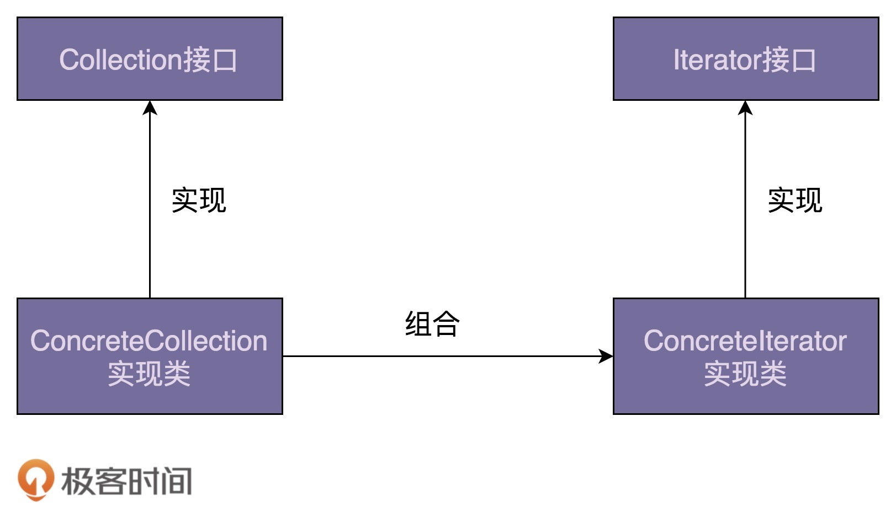
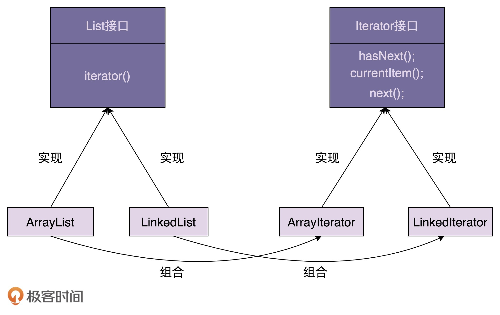

# 65 | 迭代器模式（上）：相比直接遍历集合数据，使用迭代器有哪些优势？
上一节课，我们学习了状态模式。状态模式是状态机的一种实现方法。它通过将事件触发的状态转移和动作执行，拆分到不同的状态类中，以此来避免状态机类中的分支判断逻辑，应对状态机类代码的复杂性。

今天，我们学习另外一种行为型设计模式，迭代器模式。它用来遍历集合对象。不过，很多编程语言都将迭代器作为一个基础的类库，直接提供出来了。在平时开发中，特别是业务开发，我们直接使用即可，很少会自己去实现一个迭代器。不过，知其然知其所以然，弄懂原理能帮助我们更好的使用这些工具类，所以，我觉得还是有必要学习一下这个模式。

我们知道，大部分编程语言都提供了多种遍历集合的方式，比如for循环、foreach循环、迭代器等。所以，今天我们除了讲解迭代器的原理和实现之外，还会重点讲一下，相对于其他遍历方式，利用迭代器来遍历集合的优势。

话不多说，让我们正式开始今天的学习吧！

## 迭代器模式的原理和实现

迭代器模式（Iterator Design Pattern），也叫作游标模式（Cursor Design Pattern）。

在开篇中我们讲到，它用来遍历集合对象。这里说的“集合对象”也可以叫“容器”“聚合对象”，实际上就是包含一组对象的对象，比如数组、链表、树、图、跳表。迭代器模式将集合对象的遍历操作从集合类中拆分出来，放到迭代器类中，让两者的职责更加单一。

迭代器是用来遍历容器的，所以，一个完整的迭代器模式一般会涉及 **容器** 和 **容器迭代器** 两部分内容。为了达到基于接口而非实现编程的目的，容器又包含容器接口、容器实现类，迭代器又包含迭代器接口、迭代器实现类。对于迭代器模式，我画了一张简单的类图，你可以看一看，先有个大致的印象。



接下来，我们通过一个例子来具体讲，如何实现一个迭代器。

开篇中我们有提到，大部分编程语言都提供了遍历容器的迭代器类，我们在平时开发中，直接拿来用即可，几乎不大可能从零编写一个迭代器。不过，这里为了讲解迭代器的实现原理，我们假设某个新的编程语言的基础类库中，还没有提供线性容器对应的迭代器，需要我们从零开始开发。现在，我们一块来看具体该如何去做。

我们知道，线性数据结构包括数组和链表，在大部分编程语言中都有对应的类来封装这两种数据结构，在开发中直接拿来用就可以了。假设在这种新的编程语言中，这两个数据结构分别对应ArrayList和LinkedList两个类。除此之外，我们从两个类中抽象出公共的接口，定义为List接口，以方便开发者基于接口而非实现编程，编写的代码能在两种数据存储结构之间灵活切换。

现在，我们针对ArrayList和LinkedList两个线性容器，设计实现对应的迭代器。按照之前给出的迭代器模式的类图，我们定义一个迭代器接口Iterator，以及针对两种容器的具体的迭代器实现类ArrayIterator和ListIterator。

我们先来看下Iterator接口的定义。具体的代码如下所示：

```
// 接口定义方式一
public interface Iterator<E> {
  boolean hasNext();
  void next();
  E currentItem();
}

// 接口定义方式二
public interface Iterator<E> {
  boolean hasNext();
  E next();
}

```

Iterator接口有两种定义方式。

在第一种定义中，next()函数用来将游标后移一位元素，currentItem()函数用来返回当前游标指向的元素。在第二种定义中，返回当前元素与后移一位这两个操作，要放到同一个函数next()中完成。

第一种定义方式更加灵活一些，比如我们可以多次调用currentItem()查询当前元素，而不移动游标。所以，在接下来的实现中，我们选择第一种接口定义方式。

现在，我们再来看下ArrayIterator的代码实现，具体如下所示。代码实现非常简单，不需要太多解释。你可以结合着我给出的demo，自己理解一下。

```
public class ArrayIterator<E> implements Iterator<E> {
  private int cursor;
  private ArrayList<E> arrayList;

  public ArrayIterator(ArrayList<E> arrayList) {
    this.cursor = 0;
    this.arrayList = arrayList;
  }

  @Override
  public boolean hasNext() {
    return cursor != arrayList.size(); //注意这里，cursor在指向最后一个元素的时候，hasNext()仍旧返回true。
  }

  @Override
  public void next() {
    cursor++;
  }

  @Override
  public E currentItem() {
    if (cursor >= arrayList.size()) {
      throw new NoSuchElementException();
    }
    return arrayList.get(cursor);
  }
}

public class Demo {
  public static void main(String[] args) {
    ArrayList<String> names = new ArrayList<>();
    names.add("xzg");
    names.add("wang");
    names.add("zheng");

    Iterator<String> iterator = new ArrayIterator(names);
    while (iterator.hasNext()) {
      System.out.println(iterator.currentItem());
      iterator.next();
    }
  }
}

```

在上面的代码实现中，我们需要将待遍历的容器对象，通过构造函数传递给迭代器类。实际上，为了封装迭代器的创建细节，我们可以在容器中定义一个iterator()方法，来创建对应的迭代器。为了能实现基于接口而非实现编程，我们还需要将这个方法定义在List接口中。具体的代码实现和使用示例如下所示：

```
public interface List<E> {
  Iterator iterator();
  //...省略其他接口函数...
}

public class ArrayList<E> implements List<E> {
  //...
  public Iterator iterator() {
    return new ArrayIterator(this);
  }
  //...省略其他代码
}

public class Demo {
  public static void main(String[] args) {
    List<String> names = new ArrayList<>();
    names.add("xzg");
    names.add("wang");
    names.add("zheng");

    Iterator<String> iterator = names.iterator();
    while (iterator.hasNext()) {
      System.out.println(iterator.currentItem());
      iterator.next();
    }
  }
}

```

对于LinkedIterator，它的代码结构跟ArrayIterator完全相同，我这里就不给出具体的代码实现了，你可以参照ArrayIterator自己去写一下。

结合刚刚的例子，我们来总结一下迭代器的设计思路。总结下来就三句话：迭代器中需要定义hasNext()、currentItem()、next()三个最基本的方法。待遍历的容器对象通过依赖注入传递到迭代器类中。容器通过iterator()方法来创建迭代器。

这里我画了一张类图，如下所示。实际上就是对上面那张类图的细化，你可以结合着一块看。



## 迭代器模式的优势

迭代器的原理和代码实现讲完了。接下来，我们来一块看一下，使用迭代器遍历集合的优势。

一般来讲，遍历集合数据有三种方法：for循环、foreach循环、iterator迭代器。对于这三种方式，我拿Java语言来举例说明一下。具体的代码如下所示：

```
List<String> names = new ArrayList<>();
names.add("xzg");
names.add("wang");
names.add("zheng");

// 第一种遍历方式：for循环
for (int i = 0; i < names.size(); i++) {
  System.out.print(names.get(i) + ",");
}

// 第二种遍历方式：foreach循环
for (String name : names) {
  System.out.print(name + ",")
}

// 第三种遍历方式：迭代器遍历
Iterator<String> iterator = names.iterator();
while (iterator.hasNext()) {
  System.out.print(iterator.next() + ",");//Java中的迭代器接口是第二种定义方式，next()既移动游标又返回数据
}

```

实际上，foreach循环只是一个语法糖而已，底层是基于迭代器来实现的。也就是说，上面代码中的第二种遍历方式（foreach循环代码）的底层实现，就是第三种遍历方式（迭代器遍历代码）。这两种遍历方式可以看作同一种遍历方式，也就是迭代器遍历方式。

从上面的代码来看，for循环遍历方式比起迭代器遍历方式，代码看起来更加简洁。那我们为什么还要用迭代器来遍历容器呢？为什么还要给容器设计对应的迭代器呢？原因有以下三个。

首先，对于类似数组和链表这样的数据结构，遍历方式比较简单，直接使用for循环来遍历就足够了。但是，对于复杂的数据结构（比如树、图）来说，有各种复杂的遍历方式。比如，树有前中后序、按层遍历，图有深度优先、广度优先遍历等等。如果由客户端代码来实现这些遍历算法，势必增加开发成本，而且容易写错。如果将这部分遍历的逻辑写到容器类中，也会导致容器类代码的复杂性。

前面也多次提到，应对复杂性的方法就是拆分。我们可以将遍历操作拆分到迭代器类中。比如，针对图的遍历，我们就可以定义DFSIterator、BFSIterator两个迭代器类，让它们分别来实现深度优先遍历和广度优先遍历。

其次，将游标指向的当前位置等信息，存储在迭代器类中，每个迭代器独享游标信息。这样，我们就可以创建多个不同的迭代器，同时对同一个容器进行遍历而互不影响。

最后，容器和迭代器都提供了抽象的接口，方便我们在开发的时候，基于接口而非具体的实现编程。当需要切换新的遍历算法的时候，比如，从前往后遍历链表切换成从后往前遍历链表，客户端代码只需要将迭代器类从LinkedIterator切换为ReversedLinkedIterator即可，其他代码都不需要修改。除此之外，添加新的遍历算法，我们只需要扩展新的迭代器类，也更符合开闭原则。

## 重点回顾

好了，今天的内容到此就讲完了。我们一块来总结回顾一下，你需要重点掌握的内容。

迭代器模式，也叫游标模式。它用来遍历集合对象。这里说的“集合对象”，我们也可以叫“容器”“聚合对象”，实际上就是包含一组对象的对象，比如，数组、链表、树、图、跳表。

一个完整的迭代器模式，一般会涉及容器和容器迭代器两部分内容。为了达到基于接口而非实现编程的目的，容器又包含容器接口、容器实现类，迭代器又包含迭代器接口、迭代器实现类。容器中需要定义iterator()方法，用来创建迭代器。迭代器接口中需要定义hasNext()、currentItem()、next()三个最基本的方法。容器对象通过依赖注入传递到迭代器类中。

遍历集合一般有三种方式：for循环、foreach循环、迭代器遍历。后两种本质上属于一种，都可以看作迭代器遍历。相对于for循环遍历，利用迭代器来遍历有下面三个优势：

- 迭代器模式封装集合内部的复杂数据结构，开发者不需要了解如何遍历，直接使用容器提供的迭代器即可；
- 迭代器模式将集合对象的遍历操作从集合类中拆分出来，放到迭代器类中，让两者的职责更加单一；
- 迭代器模式让添加新的遍历算法更加容易，更符合开闭原则。除此之外，因为迭代器都实现自相同的接口，在开发中，基于接口而非实现编程，替换迭代器也变得更加容易。

## 课堂讨论

1. 在Java中，如果在使用迭代器的同时删除容器中的元素，会导致迭代器报错，这是为什么呢？如何来解决这个问题呢？
2. 除了编程语言中基础类库提供的针对集合对象的迭代器之外，实际上，迭代器还有其他的应用场景，比如MySQL ResultSet类提供的first()、last()、previous()等方法，也可以看作一种迭代器，你能分析一下它的代码实现吗？

欢迎留言和我分享你的想法。如果有收获，欢迎你把这篇文章分享给你的朋友。