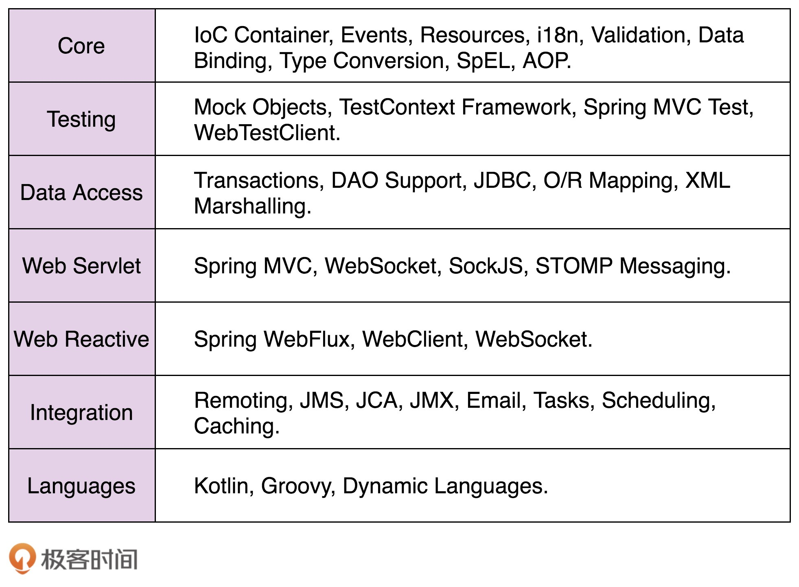
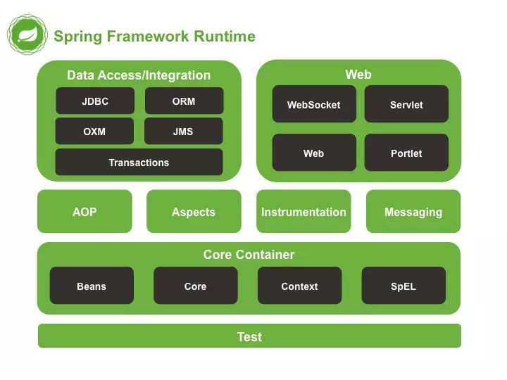

# 84 | 开源实战四（上）：剖析Spring框架中蕴含的经典设计思想或原则
在Java世界里，Spring框架已经几乎成为项目开发的必备框架。作为如此优秀和受欢迎的开源项目，它是我们源码阅读的首选材料之一，不管是设计思想，还是代码实现，都有很多值得我们学习的地方。接下来，我们就详细讲讲Spring框架中蕴含的设计思想、原则和模式。因为内容比较多，我分三部分来讲解。

- 第一部分，我们讲解Spring框架中蕴含的经典设计思想或原则。
- 第二部分，我们讲解Spring框架中用来支持扩展的两种设计模式。
- 第三部分，我们总结罗列Spring框架中用到的其他十几种设计模式。

今天，我们就讲下第一部分：Spring框架中蕴含的一些设计思想或原则，这其中就包括：约定大于配置、低侵入松耦合、模块化轻量级等。这些设计思想都很通用，掌握之后，我们可以借鉴用到其他框架的开发中。

话不多少，让我们正式开始今天的学习吧！

## Spring框架简单介绍

考虑到你可能不熟悉Spring，我这里对它做下简单介绍。我们常说的Spring框架，是指Spring Framework基础框架。Spring Framework是整个Spring生态（也被称作Spring全家桶）的基石。除了Spring Framework，Spring全家桶中还有更多基于Spring Framework开发出来的、整合更多功能的框架，比如Spring Boot、Spring Cloud。

在Spring全家桶中，Spring Framework是最基础、最底层的一部分。它提供了最基础、最核心的IOC和AOP功能。当然，它包含的功能还不仅如此，还有其他比如事务管理（Transactions）、MVC框架（Spring MVC）等很多功能。下面这个表格，是我从Spring官网上找的，关于Spring Framework的功能介绍，你可以大略地看下有个印象。

在Spring Framework中，Spring MVC出镜率很高，经常被单独拎出来使用。它是支持Web开发的MVC框架，提供了URL路由、Session管理、模板引擎等跟Web开发相关的一系列功能。

Spring Boot是基于Spring Framework开发的。它更加专注于微服务开发。之所以名字里带有“Boot”一词，跟它的设计初衷有关。Spring Boot的设计初衷是快速启动一个项目，利用它可以快速地实现一个项目的开发、部署和运行。Spring Boot支持的所有功能都是围绕着这个初衷设计的，比如：集成很多第三方开发包、简化配置（比如，规约优于配置）、集成内嵌Web容器（比如，Tomcat、Jetty）等。

单个的微服务开发，使用Spring Boot就足够了，但是，如果要构建整个微服务集群，就需要用到Spring Cloud了。Spring Cloud主要负责微服务集群的服务治理工作，包含很多独立的功能组件，比如Spring Cloud Sleuth调用链追踪、Spring Cloud Config配置中心等。

## 从Spring看框架的作用

如果你使用过一些框架来做开发，你应该能感受到使用框架开发的优势。这里我稍微总结一下。利用框架的好处有：解耦业务和非业务开发、让程序员聚焦在业务开发上；隐藏复杂实现细节、降低开发难度、减少代码bug；实现代码复用、节省开发时间；规范化标准化项目开发、降低学习和维护成本等等。实际上，如果要用一句话来总结一下的话，那就是简化开发！

对于刚刚的总结，我们再详细解释一下。

相比单纯的CRUD业务代码开发，非业务代码开发要更难一些。所以，将一些非业务的通用代码开发为框架，在项目中复用，除了节省开发时间之外，也降低了项目开发的难度。除此之外，框架经过多个项目的多次验证，比起每个项目都重新开发，代码的bug会相对少一些。而且，不同的项目使用相同的框架，对于研发人员来说，从一个项目切换到另一个项目的学习成本，也会降低很多。

接下来，我们再拿常见的Web项目开发来举例说明一下。

通过在项目中引入Spring MVC开发框架，开发一个Web应用，我们只需要创建Controller、Service、Repository三层类，在其中填写相应的业务代码，然后做些简单的配置，告知框架Controller、Service、Repository类之间的调用关系，剩下的非业务相关的工作，比如，对象的创建、组装、管理，请求的解析、封装，URL与Controller之间的映射，都由框架来完成。

不仅如此，如果我们直接引入功能更强大的Spring Boot，那将应用部署到Web容器的工作都省掉了。Spring Boot内嵌了Tomcat、Jetty等Web容器。在编写完代码之后，我们用一条命令就能完成项目的部署、运行。

## Spring框架蕴含的设计思想

在Google Guava源码讲解中，我们讲到开发通用功能模块的一些比较普适的开发思想，比如产品意识、服务意识、代码质量意识、不要重复早轮子等。今天，我们剖析一下Spring框架背后的一些经典设计思想（或开发技巧）。这些设计思想并非Spring独有，都比较通用，能借鉴应用在很多通用功能模块的设计开发中。这也是我们学习Spring源码的价值所在。

### 1.约定优于配置

在使用Spring开发的项目中，配置往往会比较复杂、繁琐。比如，我们利用Spring MVC来开发Web应用，需要配置每个Controller类以及Controller类中的接口对应的URL。

如何来简化配置呢？一般来讲，有两种方法，一种是基于注解，另一种是基于约定。这两种配置方式在Spring中都有用到。Spring在最小化配置方面做得淋漓尽致，有很多值得我们借鉴的地方。

基于注解的配置方式，我们在指定类上使用指定的注解，来替代集中的XML配置。比如，我们使用@RequestMapping注解，在Controller类或者接口上，标注对应的URL；使用@Transaction注解表明支持事务等。

基于约定的配置方式，也常叫作“约定优于配置”或者“规约优于配置”（Convention over Configuration）。通过约定的代码结构或者命名来减少配置。说直白点，就是提供配置的默认值，优先使用默认值。程序员只需要设置那些偏离约定的配置就可以了。

比如，在Spring JPA（基于ORM框架、JPA规范的基础上，封装的一套JPA应用框架）中，我们约定类名默认跟表名相同，属性名默认跟表字段名相同，String类型对应数据库中的varchar类型，long类型对应数据库中的bigint类型等等。

基于刚刚的约定，代码中定义的Order类就对应数据库中的“order”表。只有在偏离这一约定的时候，例如数据库中表命名为“order\_info”而非“order”，我们才需要显示地去配置类与表的映射关系（Order类->order\_info表）。

实际上，约定优于配置，很好地体现了“二八法则”。在平时的项目开发中，80%的配置使用默认配置就可以了，只有20%的配置必须用户显式地去设置。所以，基于约定来配置，在没有牺牲配置灵活性的前提下，节省了我们大量编写配置的时间，省掉了很多不动脑子的纯体力劳动，提高了开发效率。除此之外，基于相同的约定来做开发，也减少了项目的学习成本和维护成本。

### 2.低侵入、松耦合

框架的侵入性是衡量框架好坏的重要指标。所谓低侵入指的是，框架代码很少耦合在业务代码中。低侵入意味着，当我们要替换一个框架的时候，对原有的业务代码改动会很少。相反，如果一个框架是高度侵入的，代码高度侵入到业务代码中，那替换成另一个框架的成本将非常高，甚至几乎不可能。这也是一些长期维护的老项目，使用的框架、技术比较老旧，又无法更新的一个很重要的原因。

实际上，低侵入是Spring框架遵循的一个非常重要的设计思想。

Spring提供的IOC容器，在不需要Bean继承任何父类或者实现任何接口的情况下，仅仅通过配置，就能将它们纳入进Spring的管理中。如果我们换一个IOC容器，也只是重新配置一下就可以了，原有的Bean都不需要任何修改。

除此之外，Spring提供的AOP功能，也体现了低侵入的特性。在项目中，对于非业务功能，比如请求日志、数据采点、安全校验、事务等等，我们没必要将它们侵入进业务代码中。因为一旦侵入，这些代码将分散在各个业务代码中，删除、修改的成本就变得很高。而基于AOP这种开发模式，将非业务代码集中放到切面中，删除、修改的成本就变得很低了。

### 3.模块化、轻量级

我们知道，十几年前，EJB是Java企业级应用的主流开发框架。但是，它非常臃肿、复杂，侵入性、耦合性高，开发、维护和学习成本都不低。所以，为了替代笨重的EJB，Rod Johnson开发了一套开源的Interface21框架，提供了最基本的IOC功能。实际上，Interface21框架就是Spring框架的前身。

但是，随着不断的发展，Spring现在也不单单只是一个只包含IOC功能的小框架了，它显然已经壮大成了一个“平台”或者叫“生态”，包含了各种五花八门的功能。尽管如此，但它也并没有重蹈覆辙，变成一个像EJB那样的庞大难用的框架。那Spring是怎么做到的呢？

这就要归功于Spring的模块化设计思想。我们先看一张图，如下所示，它是Spring Framework的模块和分层介绍图。

从图中我们可以看出，Spring在分层、模块化方面做得非常好。每个模块都只负责一个相对独立的功能。模块之间关系，仅有上层对下层的依赖关系，而同层之间以及下层对上层，几乎没有依赖和耦合。除此之外，在依赖Spring的项目中，开发者可以有选择地引入某几个模块，而不会因为需要一个小的功能，就被强迫引入整个Spring框架。所以，尽管Spring Framework包含的模块很多，已经有二十几个，但每个模块都非常轻量级，都可以单独拿来使用。正因如此，到现在，Spring框架仍然可以被称为是一个轻量级的开发框架。

### 4.再封装、再抽象

Spring不仅仅提供了各种Java项目开发的常用功能模块，而且还对市面上主流的中间件、系统的访问类库，做了进一步的封装和抽象，提供了更高层次、更统一的访问接口。

比如，Spring提供了spring-data-redis模块，对Redis Java开发类库（比如Jedis、Lettuce）做了进一步的封装，适配Spring的访问方式，让编程访问Redis更加简单。

还有我们下节课要讲的Spring Cache，实际上也是一种再封装、再抽象。它定义了统一、抽象的Cache访问接口，这些接口不依赖具体的Cache实现（Redis、Guava Cache、Caffeine等）。在项目中，我们基于Spring提供的抽象统一的接口来访问Cache。这样，我们就能在不修改代码的情况下，实现不同Cache之间的切换。

除此之外，还记得我们之前在模板模式中，讲过的JdbcTemplate吗？实际上，它也是对JDBC的进一步封装和抽象，为的是进一步简化数据库编程。不仅如此，Spring对JDBC异常也做了进一步的封装。封装的数据库异常继承自DataAccessException运行时异常。这类异常在开发中无需强制捕获，从而减少了不必要的异常捕获和处理。除此之外，Spring封装的数据库异常，还屏蔽了不同数据库异常的细节（比如，不同的数据库对同一报错定义了不同的错误码），让异常的处理更加简单。

## 重点回顾

好了，今天的内容到此就讲完了。我们一块来总结回顾一下，你需要重点掌握的内容。

借助Spring框架，我们总结了框架的作用：解耦业务和非业务开发、让程序员聚焦在业务开发上；隐藏复杂实现细节、降低开发难度、减少代码bug；实现代码复用、节省开发时间；规范化标准化项目开发、降低学习和维护成本等。实际上，如果要用一句话来总结一下的话，那就是简化开发！

除此之外，我们还重点讲解了Sping背后蕴含的一些经典设计思想，主要有：约定优于配置，低侵入、松耦合，模块化、轻量级，再封装、再抽象。这些设计思想都比较通用，我们可以借鉴到其他框架的开发中。

## 课堂讨论

1. “约定优于配置”在很多开发场景中都有体现，比如Maven、Gradle构建工具，它们约定了一套默认的项目目录结构，除此之外，你还能想到体现这条设计思想的其他哪些开发场景吗？
2. 参照Spring的设计思想，分析一个你熟悉框架、类库、功能组件背后的设计思想。

欢迎留言和我分享你的想法，如果有收获，也欢迎你把这篇文章分享给你的朋友。