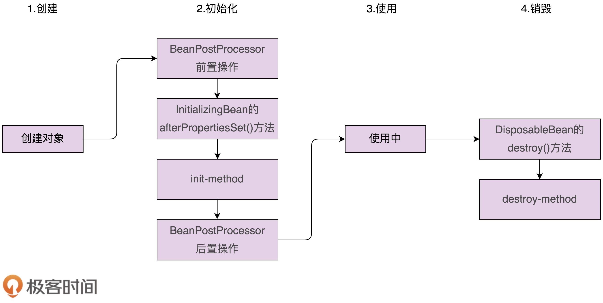

# 85 | 开源实战四（中）：剖析Spring框架中用来支持扩展的两种设计模式
上一节课中，我们学习了Spring框架背后蕴藏的一些经典设计思想，比如约定优于配置、低侵入松耦合、模块化轻量级等等。我们可以将这些设计思想借鉴到其他框架开发中，在大的设计层面提高框架的代码质量。这也是我们在专栏中讲解这部分内容的原因。

除了上一节课中讲到的设计思想，实际上，可扩展也是大部分框架应该具备的一个重要特性。所谓的框架可扩展，我们之前也提到过，意思就是，框架使用者在不修改框架源码的情况下，基于扩展点定制扩展新的功能。

前面在理论部分，我们也讲到，常用来实现扩展特性的设计模式有：观察者模式、模板模式、职责链模式、策略模式等。今天，我们再剖析Spring框架为了支持可扩展特性用的2种设计模式：观察者模式和模板模式。

话不多说，让我们正式开始今天的学习吧！

## 观察者模式在Spring中的应用

在前面我们讲到，Java、Google Guava都提供了观察者模式的实现框架。Java提供的框架比较简单，只包含java.util.Observable和java.util.Observer两个类。Google Guava提供的框架功能比较完善和强大：通过EventBus事件总线来实现观察者模式。实际上，Spring也提供了观察者模式的实现框架。今天，我们就再来讲一讲它。

Spring中实现的观察者模式包含三部分：Event事件（相当于消息）、Listener监听者（相当于观察者）、Publisher发送者（相当于被观察者）。我们通过一个例子来看下，Spring提供的观察者模式是怎么使用的。代码如下所示：

```
// Event事件
public class DemoEvent extends ApplicationEvent {
  private String message;

  public DemoEvent(Object source, String message) {
    super(source);
  }

  public String getMessage() {
    return this.message;
  }
}

// Listener监听者
@Component
public class DemoListener implements ApplicationListener<DemoEvent> {
  @Override
  public void onApplicationEvent(DemoEvent demoEvent) {
    String message = demoEvent.getMessage();
    System.out.println(message);
  }
}

// Publisher发送者
@Component
public class DemoPublisher {
  @Autowired
  private ApplicationContext applicationContext;

  public void publishEvent(DemoEvent demoEvent) {
    this.applicationContext.publishEvent(demoEvent);
  }
}

```

从代码中，我们可以看出，框架使用起来并不复杂，主要包含三部分工作：定义一个继承ApplicationEvent的事件（DemoEvent）；定义一个实现了ApplicationListener的监听器（DemoListener）；定义一个发送者（DemoPublisher），发送者调用ApplicationContext来发送事件消息。

其中，ApplicationEvent和ApplicationListener的代码实现都非常简单，内部并不包含太多属性和方法。实际上，它们最大的作用是做类型标识之用（继承自ApplicationEvent的类是事件，实现ApplicationListener的类是监听器）。

```
public abstract class ApplicationEvent extends EventObject {
  private static final long serialVersionUID = 7099057708183571937L;
  private final long timestamp = System.currentTimeMillis();

  public ApplicationEvent(Object source) {
    super(source);
  }

  public final long getTimestamp() {
    return this.timestamp;
  }
}

public class EventObject implements java.io.Serializable {
    private static final long serialVersionUID = 5516075349620653480L;
    protected transient Object  source;

    public EventObject(Object source) {
        if (source == null)
            throw new IllegalArgumentException("null source");
        this.source = source;
    }

    public Object getSource() {
        return source;
    }

    public String toString() {
        return getClass().getName() + "[source=" + source + "]";
    }
}

public interface ApplicationListener<E extends ApplicationEvent> extends EventListener {
  void onApplicationEvent(E var1);
}

```

在前面讲到观察者模式的时候，我们提到，观察者需要事先注册到被观察者（JDK的实现方式）或者事件总线（EventBus的实现方式）中。那在Spring的实现中，观察者注册到了哪里呢？又是如何注册的呢？

我想你应该猜到了，我们把观察者注册到了ApplicationContext对象中。这里的ApplicationContext就相当于Google EventBus框架中的“事件总线”。不过，稍微提醒一下，ApplicationContext这个类并不只是为观察者模式服务的。它底层依赖BeanFactory（IOC的主要实现类），提供应用启动、运行时的上下文信息，是访问这些信息的最顶层接口。

实际上，具体到源码来说，ApplicationContext只是一个接口，具体的代码实现包含在它的实现类AbstractApplicationContext中。我把跟观察者模式相关的代码，摘抄到了下面。你只需要关注它是如何发送事件和注册监听者就好，其他细节不需要细究。

```
public abstract class AbstractApplicationContext extends ... {
  private final Set<ApplicationListener<?>> applicationListeners;

  public AbstractApplicationContext() {
    this.applicationListeners = new LinkedHashSet();
    //...
  }

  public void publishEvent(ApplicationEvent event) {
    this.publishEvent(event, (ResolvableType)null);
  }

  public void publishEvent(Object event) {
    this.publishEvent(event, (ResolvableType)null);
  }

  protected void publishEvent(Object event, ResolvableType eventType) {
    //...
    Object applicationEvent;
    if (event instanceof ApplicationEvent) {
      applicationEvent = (ApplicationEvent)event;
    } else {
      applicationEvent = new PayloadApplicationEvent(this, event);
      if (eventType == null) {
        eventType = ((PayloadApplicationEvent)applicationEvent).getResolvableType();
      }
    }

    if (this.earlyApplicationEvents != null) {
      this.earlyApplicationEvents.add(applicationEvent);
    } else {
      this.getApplicationEventMulticaster().multicastEvent(
            (ApplicationEvent)applicationEvent, eventType);
    }

    if (this.parent != null) {
      if (this.parent instanceof AbstractApplicationContext) {
        ((AbstractApplicationContext)this.parent).publishEvent(event, eventType);
      } else {
        this.parent.publishEvent(event);
      }
    }
  }

  public void addApplicationListener(ApplicationListener<?> listener) {
    Assert.notNull(listener, "ApplicationListener must not be null");
    if (this.applicationEventMulticaster != null) {
    this.applicationEventMulticaster.addApplicationListener(listener);
    } else {
      this.applicationListeners.add(listener);
    }
  }

  public Collection<ApplicationListener<?>> getApplicationListeners() {
    return this.applicationListeners;
  }

  protected void registerListeners() {
    Iterator var1 = this.getApplicationListeners().iterator();

    while(var1.hasNext()) {
      ApplicationListener<?> listener = (ApplicationListener)var1.next();     this.getApplicationEventMulticaster().addApplicationListener(listener);
    }

    String[] listenerBeanNames = this.getBeanNamesForType(ApplicationListener.class, true, false);
    String[] var7 = listenerBeanNames;
    int var3 = listenerBeanNames.length;

    for(int var4 = 0; var4 < var3; ++var4) {
      String listenerBeanName = var7[var4];
      this.getApplicationEventMulticaster().addApplicationListenerBean(listenerBeanName);
    }

    Set<ApplicationEvent> earlyEventsToProcess = this.earlyApplicationEvents;
    this.earlyApplicationEvents = null;
    if (earlyEventsToProcess != null) {
      Iterator var9 = earlyEventsToProcess.iterator();

      while(var9.hasNext()) {
        ApplicationEvent earlyEvent = (ApplicationEvent)var9.next();
        this.getApplicationEventMulticaster().multicastEvent(earlyEvent);
      }
    }
  }
}

```

从上面的代码中，我们发现，真正的消息发送，实际上是通过ApplicationEventMulticaster这个类来完成的。这个类的源码我只摘抄了最关键的一部分，也就是multicastEvent()这个消息发送函数。不过，它的代码也并不复杂，我就不多解释了。这里我稍微提示一下，它通过线程池，支持异步非阻塞、同步阻塞这两种类型的观察者模式。

```
public void multicastEvent(ApplicationEvent event) {
  this.multicastEvent(event, this.resolveDefaultEventType(event));
}

public void multicastEvent(final ApplicationEvent event, ResolvableType eventType) {
  ResolvableType type = eventType != null ? eventType : this.resolveDefaultEventType(event);
  Iterator var4 = this.getApplicationListeners(event, type).iterator();

  while(var4.hasNext()) {
    final ApplicationListener<?> listener = (ApplicationListener)var4.next();
    Executor executor = this.getTaskExecutor();
    if (executor != null) {
      executor.execute(new Runnable() {
        public void run() {
          SimpleApplicationEventMulticaster.this.invokeListener(listener, event);
        }
      });
    } else {
      this.invokeListener(listener, event);
    }
  }

}

```

借助Spring提供的观察者模式的骨架代码，如果我们要在Spring下实现某个事件的发送和监听，只需要做很少的工作，定义事件、定义监听器、往ApplicationContext中发送事件就可以了，剩下的工作都由Spring框架来完成。实际上，这也体现了Spring框架的扩展性，也就是在不需要修改任何代码的情况下，扩展新的事件和监听。

## 模板模式在Spring中的应用

刚刚讲的是观察者模式在Spring中的应用，现在我们再讲下模板模式。

我们来看下一下经常在面试中被问到的一个问题：请你说下Spring Bean的创建过程包含哪些主要的步骤。这其中就涉及模板模式。它也体现了Spring的扩展性。利用模板模式，Spring能让用户定制Bean的创建过程。

Spring Bean的创建过程，可以大致分为两大步：对象的创建和对象的初始化。

对象的创建是通过反射来动态生成对象，而不是new方法。不管是哪种方式，说白了，总归还是调用构造函数来生成对象，没有什么特殊的。对象的初始化有两种实现方式。一种是在类中自定义一个初始化函数，并且通过配置文件，显式地告知Spring，哪个函数是初始化函数。我举了一个例子解释一下。如下所示，在配置文件中，我们通过init-method属性来指定初始化函数。

```
public class DemoClass {
  //...

  public void initDemo() {
    //...初始化..
  }
}

// 配置：需要通过init-method显式地指定初始化方法
<bean id="demoBean" class="com.xzg.cd.DemoClass" init-method="initDemo"></bean>

```

这种初始化方式有一个缺点，初始化函数并不固定，由用户随意定义，这就需要Spring通过反射，在运行时动态地调用这个初始化函数。而反射又会影响代码执行的性能，那有没有替代方案呢？

Spring提供了另外一个定义初始化函数的方法，那就是让类实现Initializingbean接口。这个接口包含一个固定的初始化函数定义（afterPropertiesSet()函数）。Spring在初始化Bean的时候，可以直接通过bean.afterPropertiesSet()的方式，调用Bean对象上的这个函数，而不需要使用反射来调用了。我举个例子解释一下，代码如下所示。

```
public class DemoClass implements InitializingBean{
  @Override
  public void afterPropertiesSet() throws Exception {
    //...初始化...
  }
}

// 配置：不需要显式地指定初始化方法
<bean id="demoBean" class="com.xzg.cd.DemoClass"></bean>

```

尽管这种实现方式不会用到反射，执行效率提高了，但业务代码（DemoClass）跟框架代码（InitializingBean）耦合在了一起。框架代码侵入到了业务代码中，替换框架的成本就变高了。所以，我并不是太推荐这种写法。

实际上，在Spring对Bean整个生命周期的管理中，还有一个跟初始化相对应的过程，那就是Bean的销毁过程。我们知道，在Java中，对象的回收是通过JVM来自动完成的。但是，我们可以在将Bean正式交给JVM垃圾回收前，执行一些销毁操作（比如关闭文件句柄等等）。

销毁过程跟初始化过程非常相似，也有两种实现方式。一种是通过配置destroy-method指定类中的销毁函数，另一种是让类实现DisposableBean接口。因为destroy-method、DisposableBean跟init-method、InitializingBean非常相似，所以，这部分我们就不详细讲解了，你可以自行研究下。

实际上，Spring针对对象的初始化过程，还做了进一步的细化，将它拆分成了三个小步骤：初始化前置操作、初始化、初始化后置操作。其中，中间的初始化操作就是我们刚刚讲的那部分，初始化的前置和后置操作，定义在接口BeanPostProcessor中。BeanPostProcessor的接口定义如下所示：

```
public interface BeanPostProcessor {
  Object postProcessBeforeInitialization(Object var1, String var2) throws BeansException;

  Object postProcessAfterInitialization(Object var1, String var2) throws BeansException;
}

```

我们再来看下，如何通过BeanPostProcessor来定义初始化前置和后置操作？

我们只需要定义一个实现了BeanPostProcessor接口的处理器类，并在配置文件中像配置普通Bean一样去配置就可以了。Spring中的ApplicationContext会自动检测在配置文件中实现了BeanPostProcessor接口的所有Bean，并把它们注册到BeanPostProcessor处理器列表中。在Spring容器创建Bean的过程中，Spring会逐一去调用这些处理器。

通过上面的分析，我们基本上弄清楚了Spring Bean的整个生命周期（创建加销毁）。针对这个过程，我画了一张图，你可以结合着刚刚讲解一块看下。



不过，你可能会说，这里哪里用到了模板模式啊？模板模式不是需要定义一个包含模板方法的抽象模板类，以及定义子类实现模板方法吗？

实际上，这里的模板模式的实现，并不是标准的抽象类的实现方式，而是有点类似我们前面讲到的Callback回调的实现方式，也就是将要执行的函数封装成对象（比如，初始化方法封装成InitializingBean对象），传递给模板（BeanFactory）来执行。

## 重点回顾

好了，今天的内容到此就讲完了。我们一块来总结回顾一下，你需要重点掌握的内容。

今天我讲到了Spring中用到的两种支持扩展的设计模式，观察者模式和模板模式。

其中，观察者模式在Java、Google Guava、Spring中都有提供相应的实现代码。在平时的项目开发中，基于这些实现代码，我们可以轻松地实现一个观察者模式。

Java提供的框架比较简单，只包含java.util.Observable和java.util.Observer两个类。Google Guava提供的框架功能比较完善和强大，可以通过EventBus事件总线来实现观察者模式。Spring提供了观察者模式包含Event事件、Listener监听者、Publisher发送者三部分。事件发送到ApplicationContext中，然后，ApplicationConext将消息发送给事先注册好的监听者。

除此之外，我们还讲到模板模式在Spring中的一个典型应用，那就是Bean的创建过程。Bean的创建包含两个大的步骤，对象的创建和对象的初始化。其中，对象的初始化又可以分解为3个小的步骤：初始化前置操作、初始化、初始化后置操作。

## 课堂讨论

在Google Guava的EventBus实现中，被观察者发送消息到事件总线，事件总线根据消息的类型，将消息发送给可匹配的观察者。那在Spring提供的观察者模式的实现中，是否也支持按照消息类型匹配观察者呢？如果能，它是如何实现的？如果不能，你有什么方法可以让它支持吗？

欢迎留言和我分享你的想法。如果有收获，也欢迎你把这篇文章分享给你的朋友。