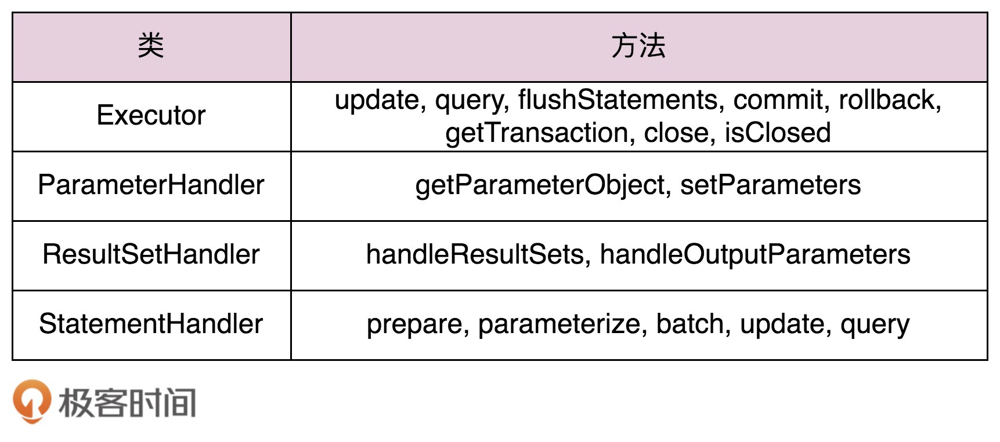

# 88 | 开源实战五（中）：如何利用职责链与代理模式实现MyBatis Plugin？
上节课，我们对MyBatis框架做了简单的背景介绍，并且通过对比各种ORM框架，学习了代码的易用性、性能、灵活性之间的关系。一般来讲，框架提供的高级功能越多，那性能损耗就会越大；框架用起来越简单，提供越简化的使用方式，那灵活性也就越低。

接下来的两节课，我们再学习一下MyBatis用到一些经典设计模式。其中，今天，我们主要讲解MyBatis Plugin。尽管名字叫Plugin（插件），但它实际上跟之前讲到的Servlet Filter（过滤器）、Spring Interceptor（拦截器）类似，设计的初衷都是为了框架的扩展性，用到的主要设计模式都是职责链模式。

不过，相对于Servlet Filter和Spring Interceptor，MyBatis Plugin中职责链模式的代码实现稍微有点复杂。它是借助动态代理模式来实现的职责链。今天我就带你看下，如何利用这两个模式实现MyBatis Plugin。

话不多说，让我们正式开始今天的学习吧！

## MyBatis Plugin功能介绍

实际上，MyBatis Plugin跟Servlet Filter、Spring Interceptor的功能是类似的，都是在不需要修改原有流程代码的情况下，拦截某些方法调用，在拦截的方法调用的前后，执行一些额外的代码逻辑。它们的唯一区别在于拦截的位置是不同的。Servlet Filter主要拦截Servlet请求，Spring Interceptor主要拦截Spring管理的Bean方法（比如Controller类的方法等），而MyBatis Plugin主要拦截的是MyBatis在执行SQL的过程中涉及的一些方法。

MyBatis Plugin使用起来比较简单，我们通过一个例子来快速看下。

假设我们需要统计应用中每个SQL的执行耗时，如果使用MyBatis Plugin来实现的话，我们只需要定义一个SqlCostTimeInterceptor类，让它实现MyBatis的Interceptor接口，并且，在MyBatis的全局配置文件中，简单声明一下这个插件就可以了。具体的代码和配置如下所示：

```
@Intercepts({
        @Signature(type = StatementHandler.class, method = "query", args = {Statement.class, ResultHandler.class}),
        @Signature(type = StatementHandler.class, method = "update", args = {Statement.class}),
        @Signature(type = StatementHandler.class, method = "batch", args = {Statement.class})})
public class SqlCostTimeInterceptor implements Interceptor {
  private static Logger logger = LoggerFactory.getLogger(SqlCostTimeInterceptor.class);

  @Override
  public Object intercept(Invocation invocation) throws Throwable {
    Object target = invocation.getTarget();
    long startTime = System.currentTimeMillis();
    StatementHandler statementHandler = (StatementHandler) target;
    try {
      return invocation.proceed();
    } finally {
      long costTime = System.currentTimeMillis() - startTime;
      BoundSql boundSql = statementHandler.getBoundSql();
      String sql = boundSql.getSql();
      logger.info("执行 SQL：[ {} ]执行耗时[ {} ms]", sql, costTime);
    }
  }

  @Override
  public Object plugin(Object target) {
    return Plugin.wrap(target, this);
  }

  @Override
  public void setProperties(Properties properties) {
    System.out.println("插件配置的信息："+properties);
  }
}

<!-- MyBatis全局配置文件：mybatis-config.xml -->
<plugins>
  <plugin interceptor="com.xzg.cd.a88.SqlCostTimeInterceptor">
    <property name="someProperty" value="100"/>
  </plugin>
</plugins>

```

因为待会我会详细地介绍MyBatis Plugin的底层实现原理，所以，这里暂时不对上面的代码做详细地解释。现在，我们只重点看下@Intercepts注解这一部分。

我们知道，不管是拦截器、过滤器还是插件，都需要明确地标明拦截的目标方法。@Intercepts注解实际上就是起了这个作用。其中，@Intercepts注解又可以嵌套@Signature注解。一个@Signature注解标明一个要拦截的目标方法。如果要拦截多个方法，我们可以像例子中那样，编写多条@Signature注解。

@Signature注解包含三个元素：type、method、args。其中，type指明要拦截的类、method指明方法名、args指明方法的参数列表。通过指定这三个元素，我们就能完全确定一个要拦截的方法。

默认情况下，MyBatis Plugin允许拦截的方法有下面这样几个：



为什么默认允许拦截的是这样几个类的方法呢？

MyBatis底层是通过Executor类来执行SQL的。Executor类会创建StatementHandler、ParameterHandler、ResultSetHandler三个对象，并且，首先使用ParameterHandler设置SQL中的占位符参数，然后使用StatementHandler执行SQL语句，最后使用ResultSetHandler封装执行结果。所以，我们只需要拦截Executor、ParameterHandler、ResultSetHandler、StatementHandler这几个类的方法，基本上就能满足我们对整个SQL执行流程的拦截了。

实际上，除了统计SQL的执行耗时，利用MyBatis Plugin，我们还可以做很多事情，比如分库分表、自动分页、数据脱敏、加密解密等等。如果感兴趣的话，你可以自己实现一下。

## MyBatis Plugin的设计与实现

刚刚我们简单介绍了MyBatis Plugin是如何使用的。现在，我们再剖析一下源码，看看如此简洁的使用方式，底层是如何实现的，隐藏了哪些复杂的设计。

相对于Servlet Filter、Spring Interceptor中职责链模式的代码实现，MyBatis Plugin的代码实现还是蛮有技巧的，因为它是借助动态代理来实现职责链的。

在 [第62节](https://time.geekbang.org/column/article/216278) 和 [第63节](https://time.geekbang.org/column/article/217395) 中，我们讲到，职责链模式的实现一般包含处理器（Handler）和处理器链（HandlerChain）两部分。这两个部分对应到Servlet Filter的源码就是Filter和FilterChain，对应到Spring Interceptor的源码就是HandlerInterceptor和HandlerExecutionChain，对应到MyBatis Plugin的源码就是Interceptor和InterceptorChain。除此之外，MyBatis Plugin还包含另外一个非常重要的类：Plugin。它用来生成被拦截对象的动态代理。

集成了MyBatis的应用在启动的时候，MyBatis框架会读取全局配置文件（前面例子中的mybatis-config.xml文件），解析出Interceptor（也就是例子中的SqlCostTimeInterceptor），并且将它注入到Configuration类的InterceptorChain对象中。这部分逻辑对应到源码如下所示：

```
public class XMLConfigBuilder extends BaseBuilder {
  //解析配置
  private void parseConfiguration(XNode root) {
    try {
     //省略部分代码...
      pluginElement(root.evalNode("plugins")); //解析插件
    } catch (Exception e) {
      throw new BuilderException("Error parsing SQL Mapper Configuration. Cause: " + e, e);
    }
  }

  //解析插件
   private void pluginElement(XNode parent) throws Exception {
    if (parent != null) {
      for (XNode child : parent.getChildren()) {
        String interceptor = child.getStringAttribute("interceptor");
        Properties properties = child.getChildrenAsProperties();
        //创建Interceptor类对象
        Interceptor interceptorInstance = (Interceptor) resolveClass(interceptor).newInstance();
        //调用Interceptor上的setProperties()方法设置properties
        interceptorInstance.setProperties(properties);
        //下面这行代码会调用InterceptorChain.addInterceptor()方法
        configuration.addInterceptor(interceptorInstance);
      }
    }
  }
}

// Configuration类的addInterceptor()方法的代码如下所示
public void addInterceptor(Interceptor interceptor) {
  interceptorChain.addInterceptor(interceptor);
}

```

我们再来看Interceptor和InterceptorChain这两个类的代码，如下所示。Interceptor的setProperties()方法就是一个单纯的setter方法，主要是为了方便通过配置文件配置Interceptor的一些属性值，没有其他作用。Interceptor类中intecept()和plugin()函数，以及InterceptorChain类中的pluginAll()函数，是最核心的三个函数，我们待会再详细解释。

```
public class Invocation {
  private final Object target;
  private final Method method;
  private final Object[] args;
  // 省略构造函数和getter方法...
  public Object proceed() throws InvocationTargetException, IllegalAccessException {
    return method.invoke(target, args);
  }
}
public interface Interceptor {
  Object intercept(Invocation invocation) throws Throwable;
  Object plugin(Object target);
  void setProperties(Properties properties);
}

public class InterceptorChain {
  private final List<Interceptor> interceptors = new ArrayList<Interceptor>();

  public Object pluginAll(Object target) {
    for (Interceptor interceptor : interceptors) {
      target = interceptor.plugin(target);
    }
    return target;
  }

  public void addInterceptor(Interceptor interceptor) {
    interceptors.add(interceptor);
  }

  public List<Interceptor> getInterceptors() {
    return Collections.unmodifiableList(interceptors);
  }
}

```

解析完配置文件之后，所有的Interceptor都加载到了InterceptorChain中。接下来，我们再来看下，这些拦截器是在什么时候被触发执行的？又是如何被触发执行的呢？

前面我们提到，在执行SQL的过程中，MyBatis会创建Executor、StatementHandler、ParameterHandler、ResultSetHandler这几个类的对象，对应的创建代码在Configuration类中，如下所示：

```
public Executor newExecutor(Transaction transaction, ExecutorType executorType) {
  executorType = executorType == null ? defaultExecutorType : executorType;
  executorType = executorType == null ? ExecutorType.SIMPLE : executorType;
  Executor executor;
  if (ExecutorType.BATCH == executorType) {
    executor = new BatchExecutor(this, transaction);
  } else if (ExecutorType.REUSE == executorType) {
    executor = new ReuseExecutor(this, transaction);
  } else {
    executor = new SimpleExecutor(this, transaction);
  }
  if (cacheEnabled) {
    executor = new CachingExecutor(executor);
  }
  executor = (Executor) interceptorChain.pluginAll(executor);
  return executor;
}

public ParameterHandler newParameterHandler(MappedStatement mappedStatement, Object parameterObject, BoundSql boundSql) {
  ParameterHandler parameterHandler = mappedStatement.getLang().createParameterHandler(mappedStatement, parameterObject, boundSql);
  parameterHandler = (ParameterHandler) interceptorChain.pluginAll(parameterHandler);
  return parameterHandler;
}

public ResultSetHandler newResultSetHandler(Executor executor, MappedStatement mappedStatement, RowBounds rowBounds, ParameterHandler parameterHandler,
    ResultHandler resultHandler, BoundSql boundSql) {
  ResultSetHandler resultSetHandler = new DefaultResultSetHandler(executor, mappedStatement, parameterHandler, resultHandler, boundSql, rowBounds);
  resultSetHandler = (ResultSetHandler) interceptorChain.pluginAll(resultSetHandler);
  return resultSetHandler;
}

public StatementHandler newStatementHandler(Executor executor, MappedStatement mappedStatement, Object parameterObject, RowBounds rowBounds, ResultHandler resultHandler, BoundSql boundSql) {
  StatementHandler statementHandler = new RoutingStatementHandler(executor, mappedStatement, parameterObject, rowBounds, resultHandler, boundSql);
  statementHandler = (StatementHandler) interceptorChain.pluginAll(statementHandler);
  return statementHandler;
}

```

从上面的代码中，我们可以发现，这几个类对象的创建过程都调用了InteceptorChain的pluginAll()方法。这个方法的代码前面已经给出了。你可以回过头去再看一眼。它的代码实现很简单，嵌套调用InterceptorChain上每个Interceptor的plugin()方法。plugin()是一个接口方法（不包含实现代码），需要由用户给出具体的实现代码。在之前的例子中，SQLTimeCostInterceptor的plugin()方法通过直接调用Plugin的wrap()方法来实现。wrap()方法的代码实现如下所示：

```
// 借助Java InvocationHandler实现的动态代理模式
public class Plugin implements InvocationHandler {
  private final Object target;
  private final Interceptor interceptor;
  private final Map<Class<?>, Set<Method>> signatureMap;

  private Plugin(Object target, Interceptor interceptor, Map<Class<?>, Set<Method>> signatureMap) {
    this.target = target;
    this.interceptor = interceptor;
    this.signatureMap = signatureMap;
  }

  // wrap()静态方法，用来生成target的动态代理，
  // 动态代理对象=target对象+interceptor对象。
  public static Object wrap(Object target, Interceptor interceptor) {
    Map<Class<?>, Set<Method>> signatureMap = getSignatureMap(interceptor);
    Class<?> type = target.getClass();
    Class<?>[] interfaces = getAllInterfaces(type, signatureMap);
    if (interfaces.length > 0) {
      return Proxy.newProxyInstance(
          type.getClassLoader(),
          interfaces,
          new Plugin(target, interceptor, signatureMap));
    }
    return target;
  }

  // 调用target上的f()方法，会触发执行下面这个方法。
  // 这个方法包含：执行interceptor的intecept()方法 + 执行target上f()方法。
  @Override
  public Object invoke(Object proxy, Method method, Object[] args) throws Throwable {
    try {
      Set<Method> methods = signatureMap.get(method.getDeclaringClass());
      if (methods != null && methods.contains(method)) {
        return interceptor.intercept(new Invocation(target, method, args));
      }
      return method.invoke(target, args);
    } catch (Exception e) {
      throw ExceptionUtil.unwrapThrowable(e);
    }
  }

  private static Map<Class<?>, Set<Method>> getSignatureMap(Interceptor interceptor) {
    Intercepts interceptsAnnotation = interceptor.getClass().getAnnotation(Intercepts.class);
    // issue #251
    if (interceptsAnnotation == null) {
      throw new PluginException("No @Intercepts annotation was found in interceptor " + interceptor.getClass().getName());
    }
    Signature[] sigs = interceptsAnnotation.value();
    Map<Class<?>, Set<Method>> signatureMap = new HashMap<Class<?>, Set<Method>>();
    for (Signature sig : sigs) {
      Set<Method> methods = signatureMap.get(sig.type());
      if (methods == null) {
        methods = new HashSet<Method>();
        signatureMap.put(sig.type(), methods);
      }
      try {
        Method method = sig.type().getMethod(sig.method(), sig.args());
        methods.add(method);
      } catch (NoSuchMethodException e) {
        throw new PluginException("Could not find method on " + sig.type() + " named " + sig.method() + ". Cause: " + e, e);
      }
    }
    return signatureMap;
  }

  private static Class<?>[] getAllInterfaces(Class<?> type, Map<Class<?>, Set<Method>> signatureMap) {
    Set<Class<?>> interfaces = new HashSet<Class<?>>();
    while (type != null) {
      for (Class<?> c : type.getInterfaces()) {
        if (signatureMap.containsKey(c)) {
          interfaces.add(c);
        }
      }
      type = type.getSuperclass();
    }
    return interfaces.toArray(new Class<?>[interfaces.size()]);
  }
}

```

实际上，Plugin是借助Java InvocationHandler实现的动态代理类。用来代理给target对象添加Interceptor功能。其中，要代理的target对象就是Executor、StatementHandler、ParameterHandler、ResultSetHandler这四个类的对象。wrap()静态方法是一个工具函数，用来生成target对象的动态代理对象。

当然，只有interceptor与target互相匹配的时候，wrap()方法才会返回代理对象，否则就返回target对象本身。怎么才算是匹配呢？那就是interceptor通过@Signature注解要拦截的类包含target对象，具体可以参看wrap()函数的代码实现（上面一段代码中的第16~19行）。

MyBatis中的职责链模式的实现方式比较特殊。它对同一个目标对象嵌套多次代理（也就是InteceptorChain中的pluginAll()函数要执行的任务）。每个代理对象（Plugin对象）代理一个拦截器（Interceptor对象）功能。为了方便你查看，我将pluginAll()函数的代码又拷贝到了下面。

```
public Object pluginAll(Object target) {
  // 嵌套代理
  for (Interceptor interceptor : interceptors) {
    target = interceptor.plugin(target);
    // 上面这行代码等于下面这行代码，target(代理对象)=target(目标对象)+interceptor(拦截器功能)
    // target = Plugin.wrap(target, interceptor);
  }
  return target;
}

// MyBatis像下面这样创建target(Executor、StatementHandler、ParameterHandler、ResultSetHandler），相当于多次嵌套代理
Object target = interceptorChain.pluginAll(target);

```

当执行Executor、StatementHandler、ParameterHandler、ResultSetHandler这四个类上的某个方法的时候，MyBatis会嵌套执行每层代理对象（Plugin对象）上的invoke()方法。而invoke()方法会先执行代理对象中的interceptor的intecept()函数，然后再执行被代理对象上的方法。就这样，一层一层地把代理对象上的intercept()函数执行完之后，MyBatis才最终执行那4个原始类对象上的方法。

## 重点回顾

好了，今天内容到此就讲完了。我们来一块总结回顾一下，你需要重点掌握的内容。

今天，我们带你剖析了如何利用职责链模式和动态代理模式来实现MyBatis Plugin。至此，我们就已经学习了三种职责链常用的应用场景：过滤器（Servlet Filter）、拦截器（Spring Interceptor）、插件（MyBatis Plugin）。

职责链模式的实现一般包含处理器和处理器链两部分。这两个部分对应到Servlet Filter的源码就是Filter和FilterChain，对应到Spring Interceptor的源码就是HandlerInterceptor和HandlerExecutionChain，对应到MyBatis Plugin的源码就是Interceptor和InterceptorChain。除此之外，MyBatis Plugin还包含另外一个非常重要的类：Plugin类。它用来生成被拦截对象的动态代理。

在这三种应用场景中，职责链模式的实现思路都不大一样。其中，Servlet Filter采用递归来实现拦截方法前后添加逻辑。Spring Interceptor的实现比较简单，把拦截方法前后要添加的逻辑放到两个方法中实现。MyBatis Plugin采用嵌套动态代理的方法来实现，实现思路很有技巧。

## 课堂讨论

Servlet Filter、Spring Interceptor可以用来拦截用户自己定义的类的方法，而MyBatis Plugin默认可以拦截的只有Executor、StatementHandler、ParameterHandler、ResultSetHandler这四个类的方法，而且这四个类是MyBatis实现的类，并非用户自己定义的类。那MyBatis Plugin为什么不像Servlet Filter、Spring Interceptor那样，提供拦截用户自定义类的方法的功能呢？

欢迎留言和我分享你的想法。如果有收获，也欢迎你把这篇文章分享给你的朋友。