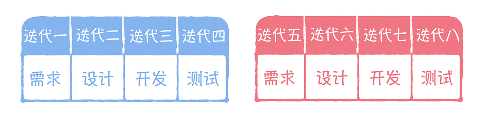
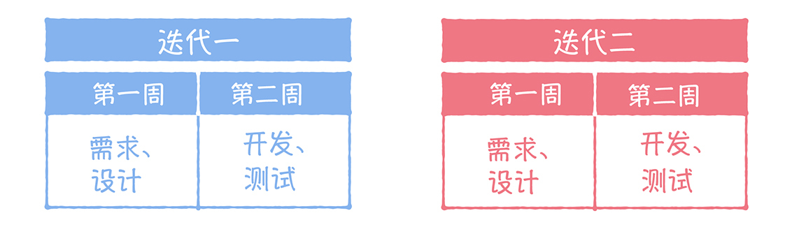

# 08 | 避雷策略：如何防止你的敏捷变为“小瀑布”？
你好，我是宋宁。

也许很多订阅咱们这门课的同学已经走在了敏捷实践的路上。然而却有很多人在做的过程中，不小心走入了敏捷的反模式。那么该如何检视你的方法是否正确呢？今天，我想用敏捷的一种反模式“小瀑布”来给你讲一下。

## 真敏捷，还是“小瀑布”？

在我做咨询的过程中，常常会看到一些团队的敏捷实践过程出现下面这些情况：

- 把一个大项目分成若干个模块，仿照“敏捷”的做法，每四个迭代做一个模块（见下图）：第一个迭代做需求，第二个做设计，第三个做开发，第四个做测试。这样四个迭代交付一个模块的内容，然后开始下一个模块的循环。做着做着，他们发现虽然这种方式比以前的瀑布模式要好一点，但整体的节奏仍然缓慢，“敏捷”好像没那么大的效益。

- 有的团队觉得上面那种方式还是太慢，于是就加快节奏。每个迭代周期也是2周，但不同的是，在一个迭代里完成一个大的功能（见下图）。第一周完成需求和设计，第二周完成开发和测试。迭代的次数增加了，但开发和测试却总感觉时间不够，每次迭代都特别赶，体验非常不好。

在上面这两种情景中，团队的感觉不好，但是却不知道自己做得到底对不对，就找我来诊断。那么，上面的做法究竟有没有问题？他们的敏捷活动做得到底对不对呢？

先来看一下他们目前的研发过程，整体来看，他们是按照“需求-设计-开发-测试”这个流程来做的。你是不是觉得似曾相识？没错，这其实就是瀑布模式。

但是他们做了一些改造，也就是引入了“迭代”这个概念。先把大项目或需求做一个模块拆分，然后再一个一个模块做下去，和瀑布模式相比，这种方式有了一点进步。然而，究其本质，它仍然还是瀑布，我们一般称它为“小瀑布”。

“小瀑布”同样具有瀑布模式的一些缺陷。比如说，很要命的一个问题就是浪费。我们看一下上面那两种做法就会发现，他们在研发中的所有步骤都是顺序进行的，这就意味着做第一步时，后面所有的步骤都处于等待状态。这样，BA（需求分析师）做需求的时候，开发测试人员在等待；开发人员写代码的时候，测试人员也在等待。这就造成了时间上的浪费。

所以，从这个角度来说， **小瀑布依旧是瀑布，它并没有改变瀑布模式的宿命，它离真正的敏捷还有相当长的一段距离。**

那么，真正的敏捷是什么样子呢？

以需求为例，一般来说，团队会尽可能有效拆分需求，这样进入到迭代内的需求就可以是多个独立的小需求。小到什么程度呢？小到每个需求都可以在很短的时间内，比如2～3天内，完成开发和测试，最长也不要超过一个迭代周期。

这样，在开发人员写代码的时候，测试人员就同步在写测试案例，或者在考虑使用自动化测试方案。由于需求拆分得足够小，所以，很可能第一个小需求在迭代后的第二天就可以交付测试了，在测试人员测试的同时，开发人员就继续开发下一个小需求，由此就形成了一个良好的循环。在这种情况下，大家都在热火朝天地工作，节省了很多等待的时间。

## 为什么你把敏捷玩成了“小瀑布”？

那为什么有的团队会把敏捷玩成“小瀑布”呢？我在接触了使用“小瀑布”的团队之后，才慢慢明白这背后的原因。

第一个原因是 **有些团队其实并没有真正地了解敏捷**，团队遇到痛点，他们只了解了皮毛，就拍脑袋炮制了一个所谓的“敏捷”流程。

比如说有一个M团队，他们的工作量很大，以前用瀑布太慢，完不成工作任务。他们领导说：“你们怎么做我不管，这个产品必须在3个月之内交付！”然而这些需求却远远超出团队的交付能力，所以当团队听到这个消息时一脸懵。他们有一个机灵鬼说：“我听说现在有人用了敏捷后，交付得很不错，要不咱们也来试试？”此话一出，M团队像是抓住了一根救命稻草，他们在很短时间内快速地上网查看别人怎么做，再按照自己的理解，把团队负责的产品按功能大卸八块，又给每个功能都定了小时间点，每个功能都用一个小瀑布做下去。

他们在这里犯了什么错呢？他们误以为敏捷就是简单地换一个工作流程，只要套用一个不知所谓的敏捷流程就能成功交付工作，而完全忽视了敏捷自身的规律。

第二个原因是 **需求太大**。团队明白使用敏捷后，需求要做拆分，也把需求做了拆分，然而由于拆分方法不当等原因，拆完后的需求还是很大，一个2周的迭代根本就做不完，或者只能灰头土脸地勉强做完。

比如有个N团队，他们每次拆分完需求后，需求的大小都要2周的迭代才能做完。这样他们每个迭代最多只能做一个需求，在研发过程中，也就只能按照做完需求分析再做设计，再做开发和测试，这样一路下来，虽然说迭代频繁了，每一步也还是需要等待对时间。

这里最大的问题，你看出来是什么了吗？没错，就是需求太大，这导致团队在做敏捷时不能充分发挥它的优势，将它做成了不折不扣的“小瀑布”。

## 如何避免把你的敏捷做成“小瀑布”？

既然我们分析了问题和原因，那到底怎么做才能避免把敏捷做成“小瀑布”呢？我想针对上面M团队和N团队的情况，再给你一些建议。

先来看M团队，针对他们不了解敏捷就开始着急模仿的做法，首先我们可以给他们讲基础知识，在他们充分了解的基础上，再培养他们的技能。

除此以外，不知道你有没有注意到一个细节，那就是他们预计的工作量要远高于他们的产能，这其实也是一个很严重的问题。其实如果工作范围没有发生变化，即便是用了敏捷的方法，或许也很难做到在3个月之内做完整个项目。

这是不是意味着这个问题就无解了呢？其实不是。

你应该还记得在敏捷的原则里，有一条是“我们最优先要做的是尽早地、持续地交付有价值的软件来使客户满意”，也就是说我们要先做有价值的东西。所以反映到这个项目中，我们其实可以 **先把客户的需求拿来看一下，挑选好需求，并先从有价值的、优先级最高的开始做。**

如果一定要卡3个月这个时间点来交付，那么就按照3个月之内我们能做多少，来选定价值最高的需求先做，因为在整个过程中我们是不断地把产品交付给客户的，所以在这个持续的过程中，我们有很大可能在3个月内交付一个令他们满意的产品。

你有没有看到，在这里我其实是把“3个月做完项目”这个目标转换成“3个月做一个让客户满意的产品”，而其实后面的那个目标才是客户最需要的。

所以在敏捷实践中， **我们工作的结束点不应该是把之前所有计划的工作做完，而是把客户需要的工作做完。** 这些工作不一定是一开始就被纳入计划的，但却一定要是客户最需要的。明白了这一点，敏捷才能被活学活用，而不是被误用成小瀑布。M团队日后的工作就是按照这个原则来做的，他们的研发工作由此慢慢走上了正轨。

接着再来看看N团队，他们的问题是需求太大。这里涉及两个层面，第一个层面是拆分方法不当，导致大需求并没有被正确拆分成小需求；第二个层面是即使拆分方法得当，拆分后的需求仍然很大。

所以第一步，我先给他们讲解了拆分需求的方法。方法有很多，例如按照业务流程、按照业务规则的变化或按照数据的处理方式进行拆分等等。

**你要注意，不管使用哪种拆分方法，做需求拆分的目的，都是把大需求拆成一个个能够独立开发测试的小需求。** 只有这样，我们才能在迭代中同时做几个小需求，而不需要等待，并且在测试完成后，这些小需求也能独立上线。

N团队之前是按照架构的层次来拆分需求的，例如把一个大需求拆成了UI层的用户故事、逻辑层的用户故事、数据访问层的故事等等。然而由于这个端到端的大需求一个迭代做不完，所以他们放到了几个迭代中。但是他们发现，每一个故事做完都不能单独测试，只能等着这一连串的故事全部做完以后才能一起测试。另外每一个故事都没有独立的价值，也不能独立上线，这样就需要大量额外的等待时间。

在认识到这个问题之后，N团队重新拆分了他们现有的需求，保证了每个小需求的独立性，之后在两周的迭代内他们已经能做好几个小需求了。

但是N团队发现他们现有的需求拆分后还是很大，无法在2周内做完，这种情况怎么办呢？这时就需要深度挖掘一下背后的原因，采用相应的应对策略了。经过细致分析，大家发现自己的系统架构比较老旧，代码的耦合度较高，依赖性大，要完成一个需求甚至要改很多个系统，这对于产品交付来说明显是一个很大的障碍。

于是团队计划在现有的开发测试工作之外，对产品进行架构演化，拆分微服务。为了能顺利开展这些工作，团队用70%的时间开发新需求，用30%的时间进行架构演进。经过大概半年的时间，N团队完成了既有架构的改造，拆分了微服务，现在他们的敏捷已经运转得越来越好。

## 总结

好了，现在我来总结一下我们今天的课程内容。

在推进敏捷的过程中，有时候一不小心就会走入它的反模式。综合上面M团队和N团队的情况，我们可以看到，如果团队只是套用敏捷流程，或是没有做好需求拆分，敏捷很容易变成“小瀑布”。

此外，还有一些其他情况也可能让你陷入敏捷的反模式，比如虽然导入了敏捷模式，却没有按照它要求的角色职责进行人员匹配。举例来说，如果直接让一个技术经理同时担任产品负责人和Scrum Master，很可能就做不好，因为这两个角色要求的技能是完全不同的，技术经理是没有足够的能力和精力来同时担当这些责任的。

但其实陷入了反模式并不可怕，重要的是你一定要保持警惕的心。在发现问题后，需要沉下心来分析原因，只有将具体原因找出了，在正确理解敏捷原则的基础上灵活使用，制定相应的对策，才能真正发挥敏捷的价值，才能继续正确地走下去。

## 思考题

现在，我想请你来思考一下，你在推进敏捷的过程中有没有犯过什么错误呢？我建议你结合今天的内容，先自己想一下怎么解决，再来留言区跟我一起讨论一下吧。

我是宋宁，欢迎你在留言区与我分享你的疑问和思考。如果你觉得这篇文章对你有启发，也欢迎你把它分享给你的朋友，我们一起来探讨和学习。